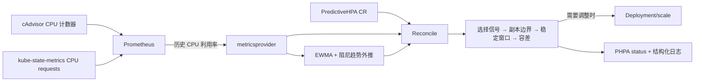

# PredictiveHPA

**用 Go 实现 Kubernetes 自定义扩缩容控制器，并用真实集群实验检验预测信号是否有用。**

[](https://github.com/TH1NKING/predictive-hpa/actions/workflows/test.yml)
[](https://github.com/TH1NKING/predictive-hpa/actions/workflows/lint.yml)
[](https://github.com/TH1NKING/predictive-hpa/actions/workflows/test-e2e.yml)
[](https://github.com/TH1NKING/predictive-hpa/actions/workflows/benchmark-harness.yml)
[](go.mod)
[](LICENSE)

PredictiveHPA（PHPA）是为了理解kubernete工作原理、流程等做的个人项目，主要学习和实践 **Go / Kubernetes / 云原生基础设施**。我想通过实现一个扩缩容控制器，理解从指标采集到副本调整的完整过程，并验证一个问题：如果在当前 CPU 指标之外引入历史趋势，能否改善扩缩容时机？

围绕这个问题，我实现了 CRD、控制器、EWMA 预测和缩容稳定窗口，打通了从声明式配置到 `Deployment/scale` 写入的流程，并在 Kind 集群中进行了容量校准和多轮对照实验。**目前的实验尚未证明预测模式能更早扩容或取得整体服务收益。** 这个结果也让我继续排查负载分流、指标可见性和协调时机，把实现过程、实验结果和设计取舍记录下来。

[运行项目](deploy/charts/predictive-hpa/README.md) · [实现与设计](docs/design.md) · [实验与结论](docs/benchmarks/README.md)

## 我做了哪些工作

| 部分 | 已实现能力 | 代码入口 |
|---|---|---|
| Kubernetes 控制器 | Kubebuilder / controller-runtime；读取 CR、查询指标、更新 Scale 子资源与 status | [Reconcile](internal/controller/predictivehpa_controller.go) |
| 指标与预测 | Prometheus 历史 CPU 查询；EWMA 平滑与阻尼趋势外推；算法和数据源分包 | [metricsprovider](internal/metricsprovider/prometheus.go)、[predictor](internal/predictor/ewma.go) |
| 扩缩容策略 | 三种决策模式、预测限幅、副本上下限、10% 容差、缩容稳定窗口 | [决策函数](internal/controller/scaling_decision.go)、[窗口历史](internal/controller/scale_history.go) |
| 自动化验证 | 单元测试、FakeClock 时间控制、envtest API 集成测试、Kind 部署烟测、实验工具离线回归 | [controller tests](internal/controller/reconcile_scale_test.go)、[CI](.github/workflows) |
| 实验与诊断 | k6 集群内 Service 发压、固定副本容量校准、匹配对照、查询与 Scale 时间记录、失败记录保留 | [实验导航](docs/benchmarks/README.md)、[工具](hack) |

## 控制器如何工作



CPU 利用率以容器的 CPU request 为参照。基础副本公式为：

```text
desiredReplicas = ceil(currentReplicas × decisionCPU / targetCPU)
```

为了在同一条控制链路中比较不同信号，我加入了三种决策模式。它们只切换决策信号，共享指标源、样本就绪要求及后续策略：

| `decisionMode` | 决策信号 | 用途 |
|---|---|---|
| `Predictive`（默认） | 限幅后的预测 CPU | 检验预测参与扩缩容的效果 |
| `Current` | 最新观测 CPU | 提供同控制器的当前值基线 |
| `Hybrid` | `max(当前值, min(限幅预测, 目标值))` | 当前需求触发扩容，预测可保留副本，但不能单独触发扩容 |

预测部分我选择了 EWMA 与阻尼系数 `0.85` 的趋势外推，并在控制器中把预测限制在 `0` 到当前 CPU 的 `1.3` 倍。正常协调默认在完成后 `30s` 重排队，缩容稳定窗口默认 `60s`。为什么这样选择、有哪些代价，以及异常路径和配置说明，我整理在了[实现与设计](docs/design.md)中。

## 实验得到了什么

### 同控制器的三种模式对照

2026-09-07，我在匹配配置下，通过集群内 Service 施加 **25 RPS step** 负载，让三种模式各运行三次。以下为描述性均值：

| 指标（每组 n=3） | Current | Predictive | Hybrid |
|---|---:|---:|---:|
| HTTP 200 成功率 | 69.85% | 68.68% | 68.40% |
| 首次成功提高 Scale 目标，距负载开始 | 48.67s | 48.67s | 48.33s |
| 总 Pod-seconds，统一 541s 窗口 | 2,101 | 2,261 | 2,181 |

三组首次扩容时间接近，全请求 p95 均接近 10s，均未达到诊断服务标准。虽然 Current 的副本占用均值较少，但这些小样本结果还不足以说明它能在保持服务质量的同时稳定降低成本。这里的 Pod-seconds 是采样副本数对时间的积分，不是 CPU 消耗或云账单。[完整结果、逐次数据与限制](docs/benchmarks/decision-mode-ablation-20260907.md)

在此前与原生 HPA 的匹配对照中，我也观察到 PHPA 扩容更晚、成功率更低的情况。不同批次的环境和方法有差异，因此我分别保留了各批次的结果，没有混合计算收益。[原生 HPA 对照](docs/benchmarks/capacity-and-controlled-pilot-20260906.md)

### 没有得到预期收益后，我继续查了什么

- **复现预测压制当前需求的路径。** 我用回归测试和日志复现了“当前 CPU 已超标，较低预测却压制扩容”的路径。Current / Hybrid 能保护该路径，但真实运行仍可能因观测值偏低而等待。[决策消融讲解](docs/benchmarks/decision-mode-ablation-guide.zh-CN.md)
- **拆分扩容前的等待。** 我记录了指标查询、决策和 Scale 写入的时间。六次 Current 运行中，首次独立观测到 CPU 超过扩容阈值平均在负载后 26.283s，此后到扩容查询开始平均再等 12.923s；查询开始到 Scale 成功响应仅 5.5–8.4ms。这让我把排查范围缩小到指标可见性与协调时机，但还不能分别确定各阶段的因果贡献。[时序诊断](docs/benchmarks/latency-diagnostic-20260907.md)
- **比较周期与窗口的代价。** 我比较了协调周期，也旁路观察了不同 CPU rate 窗口。更短协调周期的试验同时增加了副本占用与查询次数；30s CPU rate 窗口在新的三次旁路观测中有 39/59 个扩容前共同求值周期为空，60s 窗口全部有效。结合这些结果，我保留了默认 30s 协调间隔与 60s rate 窗口。[周期对照](docs/benchmarks/latency-cadence-followup-20260907.md)、[指标链路诊断](docs/benchmarks/metric-pipeline-20260908.md)

我把各批次的实验协议、报告、图表和中文讲解整理在了[实验导航](docs/benchmarks/README.md)中。大型原始运行记录保存在本地归档，仓库中提供分析工具与结果摘要；重新执行实验和复算已有摘要的证据范围不同。

## 运行项目

建议在独立 Kind 集群中体验。需要 Docker、Kind、kubectl、Helm；Go 开发与测试以 [go.mod](go.mod) 和 [Makefile](Makefile) 为准。

先按 [Helm 部署指南](deploy/charts/predictive-hpa/README.md)创建实验集群、安装 Prometheus / kube-state-metrics、构建并加载控制器镜像。控制器启动后，创建示例工作负载和 PHPA：

```bash
# 在已完成上述准备的实验集群中，从仓库根目录执行
kubectl apply -n default -f config/benchmark/php-apache.yaml
kubectl rollout status deployment/php-apache -n default --timeout=120s
kubectl apply -f config/samples/autoscaling_v1alpha1_predictivehpa.yaml
kubectl get phpa -n default -w
```

[示例 CR](config/samples/autoscaling_v1alpha1_predictivehpa.yaml)使用 1–10 个副本、50% 目标 CPU、5 分钟历史窗口和 30 秒预测视野。没有负载时保持最小副本是正常现象；Prometheus 无数据或历史样本不足时，控制器会等待重试。目标 Deployment 与 PHPA 必须同命名空间，且不要同时让原生 HPA 和 PHPA 控制同一个 Deployment。

若要验证扩缩容效果，先完成[固定副本容量校准](docs/benchmarks/service-routing-validation.md)，再按[受控对照流程](docs/benchmarks/controlled-pilot.md)发压。历史实验发现 `port-forward svc/...` 路径不足以证明新增副本分担请求，当前实验工具采用集群内 Service 路径并检查请求分布。

## 测试与代码阅读

Linux / Bash 环境，从仓库根目录执行：

```bash
make test       # 单元测试与 envtest，需要 API Server / etcd 测试二进制
make lint       # Go 静态检查
make test-e2e   # 创建/使用专用 Kind 测试集群，验证部署与 metrics

python -m pip install -r hack/analyze/requirements.txt
python -m unittest discover -s hack/tests -p 'test_*.py'
python -m unittest discover -s hack/analyze -p 'test_*.py'
```

我用 envtest 验证给定输入下的 API 交互与决策行为，用 E2E 检查控制器部署和 metrics 访问。这些测试不能代替真实负载下的性能验证，因此性能结论来自单独的集群实验。

```text
api/v1alpha1/          CRD 类型与校验标记
cmd/                  manager 入口与启动参数
internal/controller/  协调流程、副本决策、稳定窗口及测试
internal/predictor/   EWMA 与趋势外推
internal/metricsprovider/  Prometheus 查询与业务接口
deploy/charts/        Helm 部署
config/benchmark/     实验环境与工作负载配置
hack/                 k6 发压、运行控制、采集和分析工具
docs/benchmarks/      实验协议、报告、图表与中文讲解
```

## 当前边界与后续方向

- **范围：** `v1alpha1` 仅支持同命名空间的 Deployment、CPU 指标和 EWMA；不支持 scale-to-zero，`minReplicas: 0` 运行时按 1 处理。
- **状态：** 缩容历史保存在进程内存，重启或切主后会丢失。Helm 按单副本使用；manager 有 leader-election 参数，但项目尚未完成带历史恢复的 HA 方案。
- **指标：** 当前 PromQL 按 Deployment 名称前缀匹配 Pod，尚未实现基于 owner/selector 的精确归属和复杂多容器语义验证；主要证据来自单容器 `php-apache` 实验。

接下来，我计划优先补齐指标归属、缺失/陈旧数据处理与稳定历史恢复，再扩大负载场景和重复次数。多指标、其他工作负载及更复杂的预测算法也在考虑范围内，但目前还没有实现。

本项目采用 [Apache-2.0](LICENSE) 许可证。
