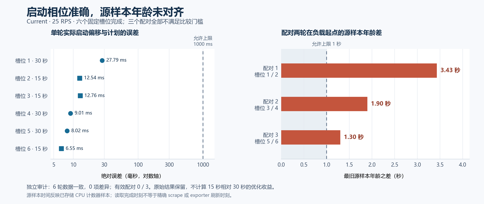

# Current 协调周期 pilot：完成六轮，尚无有效配对

我把“缩短协调周期能否更早取得有效信号”的假设推进到了真实集群验证。第二批六轮均完成，单轮证据和启动相位检查均通过；但三个配对的源样本年龄差都超过预先固定的 1 秒门槛，**有效配对为 0，无法判定 15 秒的优化效果**。这也不等于证明 15 秒无效。

独立审计重算六轮原始记录，与分析器结果没有实质差异；HTTP 百分比的既有显示舍入单独记录。下面用原始 HTTP 整数、独立重算的未舍入 p95，以及原始时间和副本积分展示结果，表格只在显示时舍入。完整精度见[紧凑数据](assets/cadence-pilot-20260914/summary.json)。

## 实验固定了什么

协议为 [cadence-pilot-v1](cadence-pilot-plan.md)。实现源码为 `59e12f2`，核对的 366 个源文件与该版本逐字节一致；Linux Go 1.26.2，Kubernetes 1.35。每轮均使用 Current 模式、CPU target 50%、副本范围 1–10、每容器 CPU request 200m／limit 500m、60 秒稳定窗口、60 秒 CPU rate 窗口和 15 秒 scrape。

唯一处理变量是 manager 的 30／15 秒协调间隔。负载为固定 25 RPS 的 step：k6 初始化后保持暂停，warm gate 后至少空闲 30 秒，再按新源样本锚点恢复；1 秒升至目标、179 秒保持、1 秒降至零，随后观察 360 秒。负载起点取实际 scenario clock，副本积分与查询统计窗口均为起点后的 541 秒。

开始前重新验证了集群内 Service 分流和固定副本容量，未直接沿用历史容量结论：

| 固定副本数 | RPS | HTTP 200／总请求 | 全请求 p95（ms） | 丢弃迭代 |
|---|---:|---:|---:|---:|
| 1 | 25 | 91／2250 | 10000.86 | 1 |
| 5 | 25 | 2250／2250 | 135.67 | 0 |

五个 Pod 的请求份额为 18.8%–21.0%。容量验证中的负载发生器 CPU 采样峰值约 0.04395 核，内存约 72.87 MiB。这证明该次环境中的多副本 Service 路径能够承载选定负载；固定副本验收不保证从一个副本开始的自动扩容能满足同样的服务准则。

## 六轮原值

“偏移”是负载起点相对新源样本观测完成时刻的秒数；“源年龄”是负载起点时最旧容器源样本的年龄。首次 Scale 取成功扩容写入响应结束时间，均相对真实负载起点。requested 和 Ready 各自按采样记录积分，单位为副本秒。

| 槽位／配对 | 周期（s） | 计划／实际偏移（s） | 源年龄（s） | 首次 Scale（s） | HTTP 200／4498（%） | 全请求 p95（ms） | 丢弃 | requested 秒 | Ready 秒 |
|---|---:|---:|---:|---:|---:|---:|---:|---:|---:|
| 1／1 | 30 | 2／2.027793 | 7.115 | 18.957 | 3137（69.7421%） | 10000.679 | 1 | 2361.851 | 2369.313 |
| 2／1 | 15 | 2／2.012538 | 3.685 | 27.204 | 2935（65.2512%） | 10000.647 | 1 | 2405.226 | 2399.235 |
| 3／2 | 15 | 7／7.012761 | 16.252 | 23.978 | 3458（76.8786%） | 10000.646 | 1 | 2482.694 | 2467.085 |
| 4／2 | 30 | 7／7.009007 | 18.150 | 40.039 | 3229（71.7875%） | 10000.683 | 1 | 2321.135 | 2315.161 |
| 5／3 | 30 | 12／12.008019 | 14.795 | 35.055 | 3405（75.7003%） | 10000.608 | 1 | 2303.231 | 2297.246 |
| 6／3 | 15 | 12／12.006546 | 13.495 | 27.160 | 3615（80.3691%） | 10000.483 | 1 | 2171.180 | 2161.179 |

六轮都未达到预定服务准则：HTTP 200 比例至少 99%、全请求 p95 不超过 500 ms、丢弃迭代为零。p95 接近配置的 10 秒请求超时；失败请求保留在统计内。服务不达标是本次运行结果，单轮证据仍可完整有效。

查询成本与新信号分别列出。每格 HTTP 请求数后的括号是这些请求的累计客户端耗时，不能解释为 Prometheus 的 CPU 消耗。“严格新观测”要求同一容器集合的每个源时间都比上次接受的观测前进。

| 槽位 | 控制器 HTTP 次数（累计 s） | 旁路 HTTP 次数（累计 s） | 控制器严格新观测 | 旁路严格新观测 | 首次 Ready 增长读取区间（s） | 起点距上次协调结束（s） |
|---|---:|---:|---:|---:|---:|---:|
| 1 | 62（0.206723） | 1072（2.488098） | 15 | 20 | [19.623, 21.683] | 11.073 |
| 2 | 104（0.302570） | 1078（2.562585） | 19 | 19 | [27.713, 29.784] | 2.859 |
| 3 | 108（0.261697） | 1074（2.503187） | 22 | 22 | [24.448, 26.569] | 6.087 |
| 4 | 62（0.163604） | 1080（2.398154） | 16 | 25 | [40.658, 42.715] | 20.033 |
| 5 | 62（0.150426） | 1076（1.912732） | 15 | 21 | [35.704, 37.771] | 24.995 |
| 6 | 112（0.192258） | 1076（1.560712） | 21 | 22 | [27.751, 29.795] | 2.878 |

该窗口内两类 HTTP 请求的错误数均为零，但仍有被 CPU 安全检查拒绝的观测：例如容器集合变化或覆盖不完整可以在发 HTTP 请求前就终止观测。因此，HTTP 成功、CPU 观测有效、源样本严格更新是三个不同条件。旁路固定观测本身的开销单列，未计入控制器请求数。

Ready 区间由“上次未增长读取开始”和“首次读到增长的读取结束”限定，不能直接证明 Pod 首次处理业务请求的时间。requested 是期望副本，Ready 是 API 可见状态；缩容、终止和读取时序可能让 Ready 副本秒暂时高于 requested，二者没有被互相替代。

## 为什么六轮有效，却没有一个有效配对

六轮均满足单轮采样覆盖与相位条件，实际偏移误差为 6.546–27.793 ms，全部小于 0.03 秒，远小于 1 秒门槛。预初始化、暂停后恢复 k6 的启动方式在这批运行中可以执行。

配对还要求两轮在负载开始时的最旧源样本年龄相差不超过 1 秒。三个配对都未通过这一项：

| 配对／顺序 | 30 秒组源年龄（s） | 15 秒组源年龄（s） | 年龄绝对差（s） | 门槛（s） | 实际偏移绝对差（s） | 配对有效 |
|---|---:|---:|---:|---:|---:|---|
| 1／30→15 | 7.115 | 3.685 | 3.430000 | ≤1 | 0.015255 | 否 |
| 2／15→30 | 18.150 | 16.252 | 1.898000 | ≤1 | 0.003754 | 否 |
| 3／30→15 | 14.795 | 13.495 | 1.299999 | ≤1 | 0.001473 | 否 |

锚点代表旁路“读到新样本”的时刻，不是源样本刚生成的时刻。即使相对读取完成的启动偏移一致，两轮读到的样本也可能已经有不同年龄。这里控制住了启动延迟，输入年龄仍未配齐。

因此分析器保留全部单轮原值，将三个 `comparison_eligible` 均标为 `false`，`delta_15_minus_30` 均保持 `null`。表中首次 Scale 或 HTTP 成功率的高低不能归因于周期变化；我没有合并两组均值作为优化效果，也没有因为某轮更早扩容就报告收益。单轮通过、配对通过和服务达标分别判断。

## 失败记录、审计与清理

首批保留了第 1 槽失败和后续 5 槽 `not_run`。失败发生于 gate 放行前：runner 计划已写出，k6 Pod 尚未创建，控制转发遇到 `PodNotFound`。零 HTTP 请求与未放行证据均已核对；恢复使用捕获 UID 和 resourceVersion 条件清理所属资源。修复有界 Pod Ready 等待后，新建独立批次执行上述六轮，原批次记录继续保留。

独立审计覆盖六个成功槽位，差异数为 0，复核出的有效配对数也是 0；工具测试与审查范围见[验证记录](cadence-pilot-validation.md)。实验结束后专用 Kind 集群和私有 kubeconfig 已清理，共享集群 UID 保持不变。原始运行、首批失败与恢复回执均保留。

本地原始归档为 `benchmark-runs/cadence-pilot-20260914/evidence.tar.gz`，共 6,714,481 字节，SHA256 为 `86a501d5b472eb0a319e6fab7e337d3dfe8065be6d9473f79c1f201c28d03769`。归档包含 1,146 份证据及完整性清单，下载后逐项核对字节数和 SHA256；清单 SHA256 为 `fec82ca54009019dcb6a5a1355371808baf670cb512139780b88af5ec47d1206`。临时 kubeconfig 和镜像 tar 缓存不在归档内，镜像摘要与导入回执保留。公开紧凑 JSON 可核对图表和逐轮数值，重新计算原始请求和日志仍需要完整本地归档。

归档的 `retention-notes.json` 另记一项外层预检限制：开始新批次时，两个 namespace 读取输出流可能反映后来一次读取，因此不把它们作为原始时刻的独立证据；原 JSON 回执及全部 campaign／run 数据保持保留。

## 下一步调整实验方法

这次已经进入真实优化验证阶段，得到的限制是配对输入年龄不一致。下一版可以预先指定负载起点的源样本年龄：在完整新样本到达后，根据保留的源时间安排恢复时刻，同时检查相位、样本新鲜度和成员稳定性是否都能满足。

这样可能增加等待时间或让一部分候选样本不具备可调度性，需要先验证时间预算，再冻结新协议和完整分配。保留原有 1 秒配对门槛；调整的是选择和安排起点的方法，不在看到结果后放宽合格标准。本轮到此结束，后续实验另行开始。
