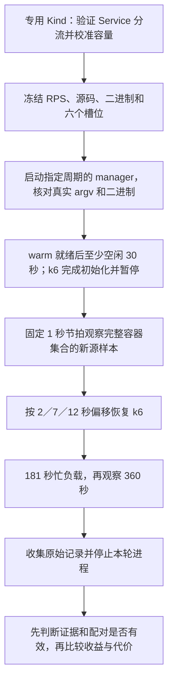

# 协调周期实验：从原因定位走到优化验证

回放已经能解释记录中的某轮为什么没有扩容。我接下来想验证的是：**固定 Current 模式，把协调间隔从 30 秒缩短到 15 秒，能否更早取得可用的新指标，并改善服务表现？代价是多少？**

`cadence-pilot-v1` 把这个问题变成三个配对、六个预先分配的运行槽位。[2026-09-14 真实结果](cadence-pilot-20260914.md)中，六轮均完成且单轮相位合格，但三个配对的源样本年龄差都超过 1 秒门槛，没有有效配对，尚不能判断 15 秒的优化效果。完整约束见[实验方案](cadence-pilot-plan.md)。

## 我把什么变成了可以验证的东西



协调参数只规定重排队间隔，事件也会触发协调。因此，15 秒配置不等于每分钟恰好协调四次，更不等于每次都拿到了新信息。代码同时记录参数、实际协调、源样本和 HTTP 请求，才能区分“查得更多”和“更早知道”。

三个配对依次使用 `30→15`、`15→30`、`30→15` 秒；相位分别为 `2`、`7`、`12` 秒。每对只改变协调间隔，固定 Current、CPU 目标、副本范围、资源请求、容差、稳定窗口、60 秒 CPU rate 窗口、15 秒 scrape、负载及分析窗口。顺序和相位在看结果前分配，避免事后挑选有利起点。

## 为什么旁路观察器复用生产观测代码

`cmd/observe-cpu` 调用 `metricsprovider.ObserveCPU`，后者进入控制器使用的同一条 CPU 校验路径：核对 Deployment UID、Pod → ReplicaSet → Deployment 所有权、容器运行实例、CPU request 和完整指标覆盖，并在查询前后重新核对容器集合。

这比另写一份 Python PromQL 更容易保持语义一致。否则，观察器可能把控制器会拒绝的旧 Pod、缺失容器或过期指标认作有效信号，实验起点就失去了意义。旁路进程有自己的观测状态，只读集群，不参与扩缩容决策。

每次接受的观测保留每个容器的 `pod_uid`、`container`、`runtime_id` 和 `source_timestamp`，以及整个观测的开始、结束和查询求值时间。拒绝的观测保留错误和已经发生的 HTTP 请求，不发布一部分“看起来有效”的容器作为完整结果。

启动 gate 要求连续两份成功观测的容器成员完全相同，且**每个容器的源时间都严格前进**；源样本不能来自未来，观测完成时年龄不能超过 45 秒。中途拒绝观测会重置这组候选。只看最旧时间变大还不够：两个容器中较旧的一个更新后，另一个仍可能停在原来的样本。

这里的锚点是“确认新样本的那次读取完成时刻”。它既不是查询求值时间，也不是 cAdvisor 真正刷新计数器的精确时刻。负载放行前还会检查 warm 状态和容器覆盖，防止等待偏移期间目标已经变化。

## 为什么统计真实 HTTP 请求

一次完整 CPU 观测通常需要 `rate(...)` 和 `timestamp(...)` 两个逻辑查询。但客户端可能在 POST 收到 HTTP 405 后改用 GET；若两个逻辑查询都发生这种回退，就产生四次 HTTP 请求。失败、超时或提前拒绝也会改变实际次数。

我在 HTTP transport 层记录每次请求的方法、查询类别、状态码、错误以及开始／结束时间，结束边界包括响应体读取。分析器分别汇总控制器和旁路观察器的请求数、耗时和错误，不用“协调次数 × 2”估算，也不把旁路开销算成控制器自己的开销。

HTTP 请求耗时反映客户端等待成本，不能直接等同于 Prometheus 的 CPU 消耗。固定 1 秒节拍的旁路观察本身也有成本，所以两组使用相同观测协议，并在报告中单列它；观测执行可能耗时，实际时间仍以回执为准。

## 为什么先初始化 k6，再按源样本放行

2 秒相位很容易被 Pod 启动、k6 初始化和虚拟用户分配耗尽。因此 k6 使用 `--paused`，初始化完成后保持暂停；观察器通过本轮专属、仅绑定本机的 Pod port-forward 检查 k6 状态，再按锚点加偏移发出一次恢复请求。控制接口服务于 k6 放行，业务请求仍从集群内经过 php-apache Service。

原 step 的 30 秒空闲移到 warm gate 之后、新锚点选择之前。忙负载仍是 1 秒升至冻结 RPS、179 秒保持、1 秒降至零，再观察 360 秒。实际起点取 k6 的 scenario clock；新协议的起点不再加 30 秒。旧 `live-baseline-v1` 数据仍按旧协议解释。

恢复请求在发送前写下尝试记录。如果响应丢失，无法断定负载没有开始，因此不自动重试放行；保留这次不确定结果比制造第二次启动更容易审计。

| 选择 | 优点 | 代价或替代方案的不足 |
|---|---|---|
| 同一生产观测路径 | 身份、完整性、新鲜度规则一致 | 需要 Go 辅助进程；另写查询容易产生语义偏差 |
| 完整容器源时间前进 | 能证明整个已验证集合出现新输入 | 条件严格，可能超时；只看聚合时间可能漏掉未更新的容器 |
| 预初始化后恢复 k6 | 减少启动耗时对短相位的干扰 | 增加控制接口和进程管理；直接启动进程的延迟更难控制 |
| 固定 Current、只比较周期 | 更容易解释差异来自哪里 | 结论范围限于这个模式和环境；同时换预测策略会混淆原因 |
| 保留原槽位及失败 | 不会只留下有利或容易完成的运行 | 可能得不到三个有效配对，不能靠静默补跑填齐 |

## 如何使用这些入口

在仓库根目录使用具备项目依赖的 Python。下面的 `17` 只是查看计划的示例 RPS，不代表本次集群的容量结论；`--plan` 不连接集群。

```bash
python3 hack/run_cadence_campaign.py --plan --rps 17
```

真实运行前，需要准备全新专用 Kind 集群，重新验证集群内 Service 的多 Pod 请求分布、完成固定副本容量校准，并冻结 RPS。campaign 命令本身不负责创建集群或完成这两项验收。设置 `CALIBRATED_RPS`、`CADENCE_CONTEXT`、`CADENCE_KUBECONFIG` 后运行；context 必须匹配 `kind-phpa-cadence-*`，私有 kubeconfig 放在输出目录之外，输出目录必须不存在。

```bash
python3 hack/run_cadence_campaign.py \
  --rps "$CALIBRATED_RPS" \
  --context "$CADENCE_CONTEXT" \
  --kubeconfig "$CADENCE_KUBECONFIG" \
  --output benchmark-runs/cadence-pilot-run
```

若同一目标已经存在上一轮留下的 PHPA，只能用 `--expected-phpa-receipt` 指向对应 `terminal-state.json`，由程序核对原 UID 和 spec；该参数不是跳过身份检查的开关。每个槽位仍核对集群节点、目标、监控配置、源码和二进制是否变化。

保留的源观测可以离线检查。`RUN_DIR` 指向单轮目录，`TARGET_UID` 来自该轮计划；`ELIGIBLE_AFTER_UTC` 是 warm 放行加 30 秒与 k6 初始化完成时间两者中的较晚值，使用带时区时间。下面检查第一对的 2 秒偏移，不会向 k6 发请求。输入应保留从序号 1 开始的完整观测流。

```bash
python3 hack/observe_cadence.py check-anchor \
  --observations "$RUN_DIR/cadence-cpu.ndjson" \
  --target-uid "$TARGET_UID" --after "$ELIGIBLE_AFTER_UTC" \
  --offset-seconds 2 --output benchmark-runs/cadence-anchor-check.json
```

单轮和整批分析也完全离线。输出文件必须是新文件，避免覆盖已有结论；整批分析会重算成功槽位的原始证据，再核对已存报告。

```bash
python3 hack/analyze/cadence.py --run-dir "$RUN_DIR" \
  --output benchmark-runs/cadence-run-analysis.json
python3 hack/analyze/cadence.py --campaign benchmark-runs/cadence-pilot-run \
  --output benchmark-runs/cadence-pairs-analysis.json
```

## 读结果时先分清三个问题

**证据是否完整？** 检查身份、观测序号、请求和进程终止回执、实际 manager 参数、分析窗口覆盖。缺失或损坏的证据不能补成零。未观察到扩容保留为空值，不伪造首次 Scale 或 Ready 时间；`MetricsReady=False` 区间来自采样边界，长时间缺口仍然未知。

**两轮能否比较？** 单轮实际相位误差不得超过 1 秒；同对实际偏移差、负载起点的最旧源样本年龄差也各不得超过 1 秒，源码、RPS 和二进制指纹必须一致。相位不合规的完整运行仍保留，但不生成可比较的差值。报告另列负载起点距上次真实协调结束的时间。

这次真实运行说明了为什么要多检查一步：六轮实际启动偏移误差都小于 0.03 秒，但配对源年龄差仍有约 3.43、1.898、1.30 秒。“读到新样本后等相同时间”不能保证“用相同年龄的样本开始”。单轮合格仍不足以推导配对合格，0 个有效配对也不证明 15 秒无效。

**服务是否达标，代价是否合理？** 本协议的服务准则是 HTTP 200 比例至少 99%、全请求 p95 不超过 500 ms、丢弃迭代为零；全请求口径保留失败请求。服务不达标可以是有效实验结果，不能因此删除该槽位。配对差值统一为 `15 秒 − 30 秒`，结合有效新观测数、查询开销和 requested／Ready 副本秒解释。

首次 Scale 使用成功写入响应结束边界；首次 Ready 增长使用“上次未增长读取开始，到首次读到增长的读取结束”的区间。它们分别反映控制请求和 API 可见状态，不能直接证明新 Pod 首次处理业务请求的时刻。requested 副本也不能代替 Ready 副本计算实际可用容量。

## 出错和中断时发生什么

六个槽位在接触集群前就写入计划。超时、身份变化、收集失败或清理失败会保留原槽位及部分文件，并停止依赖它的后续运行。runner 在收集部分数据前先停止本轮 k6；收集不完整时保留 Pod 的结果目录供恢复，不把缺文件当作成功。

正常结束通过 stop 文件让 CPU 观察器写终止统计并退出。SIGINT／SIGTERM 会进入有界清理：停止本轮观察器、转发和 controller，等待并回收进程；必要时强制终止并记录失败。Linux campaign 还跟踪自己创建的进程组，即使直接子进程退出，也检查其后代，避免“命令返回了但负载还在运行”。

这套工具的验收重点，是让“参数真的改了、读到了什么、负载何时开始、失败有没有留下”都能从证据检查。本轮已经推进到真实优化验证；下一步应在新协议中预先按源样本年龄安排负载起点，保留原有 1 秒门槛，而不根据已看到的结果放宽条件。是否存在稳定收益、是否值得改变默认配置，仍需有效配对和后续验证。
