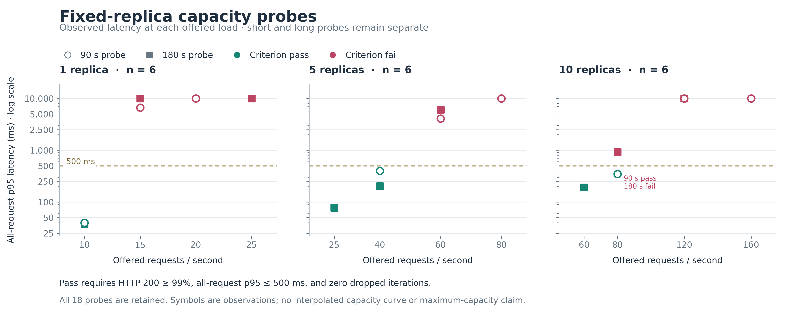
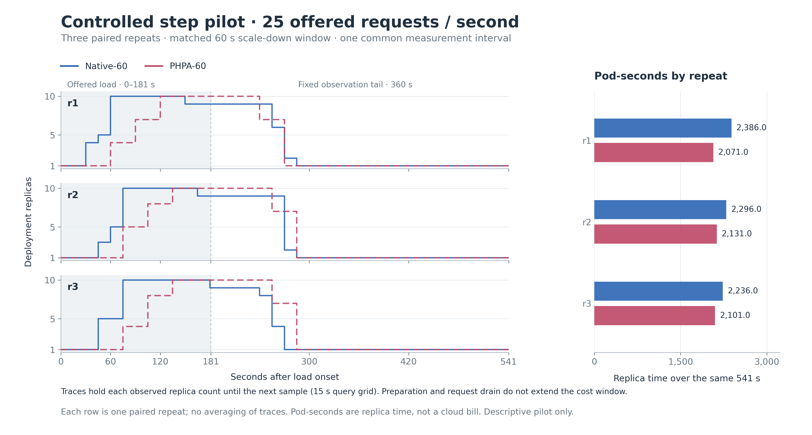

# Capacity calibration and controlled step pilot — 2026-09-06

All 18 fixed-replica probes and six matched step comparisons are complete.
In this pilot, PHPA-60 first increased replicas 30 seconds later on average,
returned HTTP 200 for 20.2 percentage points fewer requests, and used 8.9% fewer
total observation-window Pod-seconds than Native-60. Its post-load Pod-seconds
were 12.0% higher. Lower total occupancy accompanied worse service quality;
these observations do not establish an efficiency or prediction benefit.

This campaign follows the [controlled pilot protocol](controlled-pilot.md).
It extends the September 5 routing diagnostic with capacity bounds and a small
matched comparison. It is not a formal v3 campaign or an isolated ablation of
the prediction algorithm. The historical v2 release and datasets remain intact.
See the [Chinese walkthrough](controlled-pilot-guide.zh-CN.md) for the methods
and their tradeoffs.

## Capacity observations

Eighteen probes were collected in seven phases: nine initial 90-second probes,
then nine 180-second confirmation/refinement probes. All 18 have identified
requests on every target Pod and the required CPU/generator observations.
Independent raw parsing found no malformed request records or disagreement with
k6 request totals. All seven phases restored the original Deployment/HPA/PHPA
specifications; recreated autoscaler UIDs are expected to differ.

Seven probes met the preselected criterion (HTTP 200 at least 99%, all-request
p95 at most 500 ms, zero dropped iterations). Eleven did not. Six of those
eleven include dropped iterations, so their offered-load distortion is a
separate limitation rather than pure evidence of an application capacity bound.

The conservative passing points observed in 180-second probes are:

| Fixed replicas | Offered RPS | HTTP 200 | All-request p95 (ms) | Dropped |
|---:|---:|---:|---:|---:|
| 1 | 10 | 100% | 37.960 | 0 |
| 5 | 40 | 100% | 201.777 | 0 |
| 10 | 60 | 100% | 192.876 | 0 |

These are tested passing points, not exact maximum sustainable rates. Five
replicas failed the quality criterion at 60 RPS in both the short and long
probes, whereas ten replicas passed the long 60 RPS probe. No linear capacity
multiplier or statistical significance is established.

Ten replicas at 80 RPS passed the 90-second probe (p95 346.227 ms), but failed
the reverse-order 180-second probe (p95 923.667 ms), despite 100% HTTP 200 and
zero dropped iterations in both. The longer probe's p95 after excluding the
first 30-second completion-time bin was still 936.965 ms. Its later complete
30-second bins had p95 values around 778–1,027 ms, so high latency was not
confined to the opening bin. Duration, order, prior overload, Pod history and
shared-host contention remain possible contributors; this comparison cannot
attribute the difference to one of them. A separately recorded 60 RPS probe
then supplied the more conservative long-probe passing point.



## Selecting the controller workload

Before either controller run, the campaign selected **25 offered RPS** using
matched 180-second probes:

| Fixed replicas | HTTP 200 / completed records | HTTP 200 % | All / HTTP-200-only p95 (ms) | Dropped |
|---:|---:|---:|---:|---:|
| 1 | 156 / 4,499 | 3.467 | 10,000.711 / 9,173.761 | 1 |
| 5 | 4,501 / 4,501 | 100.000 | 77.734 / 77.734 | 0 |

The one-replica quality result fails independently of its single dropped
iteration, but that dropped iteration remains a limitation. Five replicas
served the tested load under the criterion. This rate therefore exercises
initial overload that can fit after expansion, instead of choosing a load
that saturates every available replica throughout the comparison.

The selected rate, exact probe identities and rationale were saved in
`selected-pilot-load.json` at `2026-09-06T13:14:42.853498+00:00`, before the
controller campaign. The fixed source commit is
`65dbde8a852ecc815a900fe9a8853b649ee02d65`.

## Matched controller comparison

Six step runs compare Native-60 and PHPA-60, three repeats each. Order is
Native/PHPA, PHPA/Native, Native/PHPA. Both use min/max replicas 1/10, CPU target
50%, the same application image and resource settings, and a 60-second
scale-down stabilization window. The load starts after a 30-second quiet
period and observation ends at planned offered-load end +360 seconds: a
common 541-second resource window from load onset.

The new `measurement` fields exclude preparation and variable request-drain or
artifact-copy time. Replica timings and Pod-seconds use sampled Deployment
status replicas on a 15-second grid, with step-held values between samples.
They are estimates of replica occupancy, not API decision timestamps, CPU
consumption or billing. HTTP metrics retain completed failures/timeouts and
in-flight requests finishing after offered load ends.

All six measurements are valid and end after a return to one replica; none is
scale-down censored. The table follows execution order. Request success counts
strict HTTP 200 responses; each all-request p95 includes completed failures.

| Controller | Repeat | Completed / HTTP 200 | HTTP 200 % | All / successful p95 (ms) | Dropped | First observed scale-up (s) | Total Pod-seconds | Post-load Pod-seconds |
|---|---:|---:|---:|---:|---:|---:|---:|---:|
| Native-60 | 1 | 4,499 / 4,267 | 94.84 | 9,999.85 / 1,243.99 | 0 | 30 | 2,386 | 1,042 |
| PHPA-60 | 1 | 4,498 / 2,905 | 64.58 | 10,000.69 / 2,945.74 | 1 | 60 | 2,071 | 1,071 |
| PHPA-60 | 2 | 4,498 / 3,013 | 66.99 | 10,000.69 / 3,597.81 | 1 | 75 | 2,131 | 1,206 |
| Native-60 | 2 | 4,498 / 3,754 | 83.46 | 10,000.46 / 1,897.40 | 1 | 45 | 2,296 | 1,087 |
| Native-60 | 3 | 4,498 / 3,535 | 78.59 | 10,000.59 / 2,271.67 | 1 | 45 | 2,236 | 982 |
| PHPA-60 | 3 | 4,498 / 2,909 | 64.67 | 10,000.67 / 3,064.44 | 1 | 75 | 2,101 | 1,206 |

Each group has **n=3**. Values below are descriptive means ± sample standard
deviations; differences compare group means, not a significance test.

| Metric | Native-60 | PHPA-60 | PHPA minus Native |
|---|---:|---:|---:|
| HTTP 200 (%) | 85.63 ± 8.3 | 65.41 ± 1.4 | −20.2 percentage points |
| First observed scale-up (s) | 40 ± 8.7 | 70 ± 8.7 | +30 |
| Peak replicas | 10 ± 0 | 10 ± 0 | 0 |
| Total Pod-seconds over 541s | 2,306 ± 75.5 | 2,101 ± 30.0 | −205 (−8.9%) |
| Post-load Pod-seconds over 360s | 1,037 ± 52.7 | 1,161 ± 77.9 | +124 (+12.0%) |
| Post-load excess Pod-seconds above minimum | 677 ± 52.7 | 801 ± 77.9 | +124 (+18.3%) |
| Full scale-down after load end (s) | 99 ± 8.7 | 99 ± 8.7 | 0 |

In all three pairs, PHPA's first observed increase is 30 seconds later. The
paired total-cost differences are −315, −165 and −135 Pod-seconds. Its lower
total occupancy is concentrated in the load period; it retains more post-load
replica time on average. Matching mean time to return to one Pod does not
imply matching tail cost, because the intermediate replica counts differ.



Both controllers fail the diagnostic service criterion in every dynamic run:
all-request p95 is close to the 10-second timeout ceiling and success remains
below 99%. Five runs each drop one iteration (Native total 2; PHPA total 3),
so actual delivered load differs slightly from the offered schedule. These
losses are retained separately. The workload can fit after expansion, but
neither controller avoids the transient service degradation in this pilot.
Saturated all-request p95 is a weak discriminator here; the HTTP 200 fraction
and success-only latency add necessary context.

Independent analysis checked raw request counts/quantiles, replica integrals,
all six metadata/extract identities, source/configuration hashes, 2,592 artifact
checksums, three controller binaries and per-Pod experiment request markers.
No controller trial was excluded or rerun. This remains a single-pattern,
small-sample comparison of complete controllers, not a general workload ranking
or a causal estimate for EWMA alone.

The decision logs give a concrete observation without isolating a cause for
the whole outcome. Around 29 seconds after load onset in PHPA repeat 2,
current CPU was 98.65%, the prediction was 52.87%, and the 50% target's
tolerance band suppressed scaling (`WithinToleranceBand`). In repeats 1 and
3, the corresponding early predictions were below the target. First logged
`scaled=true` messages were at approximately +58/+59/+59 seconds, while the
first sampled replica increases were +60/+75/+75 seconds. This distinction
illustrates why sampled replica timing is not an exact API decision time.

## Source, environment and validation

Calibration used clean baseline commit
`61e84a8355304bcd9c9ecacfaf7dac1359eab1ad`; the pilot uses the separate clean
checkout of `65dbde8a852ecc815a900fe9a8853b649ee02d65`. The VM's pre-existing
dirty repository was not used as the execution checkout.

- Dedicated cluster/context: `hpa-dev` / `kind-hpa-dev`, one Kind node on the
  Ubuntu VM with eight virtual CPUs and approximately 7.70 GiB RAM.
- Application resources: CPU request 200m, CPU limit 500m per Pod.
- k6 requests 500m CPU and 512Mi memory, has no CPU limit, and a 1Gi memory
  limit. The pilot allocates 250 VUs initially and permits 300; connection
  reuse is disabled and requests carry a unique experiment User-Agent.
- The application and generator share the VM/node. Low sampled generator usage
  alone cannot rule out brief saturation or host contention.
- PHPA runs as a host process compiled from the fixed source, with the
  in-cluster PHPA manager kept at zero replicas. Native HPA runs in the
  Kubernetes control plane. Metric sources, actual reconciliation frequency,
  scale policies and this execution placement remain differences between the
  complete controllers.

Each pilot's `prom.json` includes `load_generator_cpu` and
`load_generator_memory`. Independent checks selected the exact runner Pod and
its measured execution interval: sampled peak CPU was 0.029–0.046 cores and
working-set memory was 80.21–85.72 MiB. Each run had 12–14 CPU samples and 14
memory samples; no generator restart or telemetry error was observed. These
sampled observations do not establish continuous headroom on the shared VM.

Pinned image references:

```text
grafana/k6:1.3.0@sha256:a90b459a3768c46ad1013da53af24189f735d7112273c6ac3212ca8ed0e18656
registry.k8s.io/hpa-example@sha256:581697a37f0e136db86d6b30392f0db40ce99c8248a7044c770012f4e8491544
```

All **67 offline tests** passed (36 runner/script tests, 31 analysis tests),
including effective RPS/VU behavior, rotation, configuration-sensitive resume,
invalid-measurement failure handling, matching metadata/extract identities and
fixed-window costs. Standards review reported no findings; Spec review's
completion/resume and stale-extraction findings were corrected and rechecked.

Linux `make test` passed on the clean pilot source using Go 1.26.2 and envtest
Kubernetes 1.35.0, completing at `2026-09-06T13:25:22.154542+00:00`. It includes
generation checks, formatting, vetting and the controller, provider and
predictor tests. The source remained clean afterward. An earlier preparation
attempt used relative cache links that did not satisfy the Makefile's absolute
link check, triggered a tool download, and failed at a Go proxy checksum mirror
with HTTP 504. Correcting those links reused the already cached tools; the
failed and passing attempt logs are retained separately.

## Evidence locations, restoration and integrity

Raw evidence is retained in the VM campaign directory
`/home/baiwenchen/phpa-capacity-pilot-20260906/` and the ignored local directory
`benchmark-runs/capacity-pilot-20260906/`. These are retained workspace artifacts;
no public release endpoint is claimed.

The controller wrapper completed at `2026-09-06T14:27:45Z`, with wrapper,
matrix and restoration exit codes all zero. The telemetry supervisor reports
all owned processes stopped and complete telemetry. Original workload and
autoscaler specifications were restored, and the frozen source remained clean.

All three execution archives were verified after download:

| Archive | Bytes | SHA256 |
|---|---:|---|
| `capacity-complete-evidence.tar.gz` | 15,369,938 | `c65e1149966158934202633f3aee17b3bc8b1b2eaa506cd39858b60af632014e` |
| `pilot-complete-evidence.tar.gz` | 101,165,655 | `253d8aca5eb28f28625e4fd079d2dbedbc5a184056612e65df3b46d8008cfe57` |
| `source-support-20260906.tar.gz` | 639,604 | `34a8849e8a1ff97181f7b0db757e03e1da6c99c16114dc42070684d9df83dc0a` |

The capacity archive holds all seven calibration phases. The pilot archive
holds all six raw runs, source/environment snapshots, the relative per-file
`pilot/SHA256SUMS`, dynamic Pod/endpoint/log evidence, observed controller
binaries and both Linux test attempts. The execution-support archive records
the fixed Git bundles, launch/restore/analysis helpers and workload selection.

To check the downloaded execution archives, run from their directory:

```bash
sha256sum -c final-evidence.sha256
```

The separately retained `analysis-support-20260906.tar.gz` contains the final
plotting helper, independent pilot-audit helper, audit outputs, reviewed
PNG/SVG figures and their relative-path data manifest. Its size is 610,159
bytes and SHA256 is
`d47e663221a69d6cbd328f9cc07f034abf1e24cc1f4549f01e221cb36044e25a`.
The runtime support archive above remains unchanged. All four archives are
listed in `delivery-evidence.sha256` and were checked on both retained copies.
The analysis archive preserves the original rendering bytes. Repository SVG
and manifest text normalize line endings and insignificant trailing whitespace,
with their corresponding digests in
`assets/plot-inputs-20260906.json`; the plotted data and PNGs are unchanged.

A final live check at `2026-09-06T14:41:17.815687+00:00` found the application
at 1/1 replicas, the PHPA manager at zero, no k6 runner Pods, exact original
Deployment/HPA/PHPA specifications and a clean pilot checkout. The prior VM
repository's dirty-file list remains unchanged. After evidence retrieval, the
task's one temporary authorized-key entry and both local temporary key files
were removed. `final-state.json` and `ssh-key-cleanup.json` retain these final
receipts outside the immutable execution archives.
