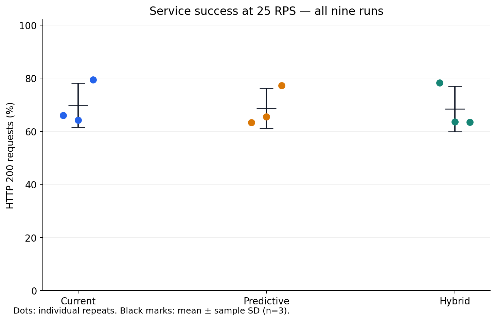
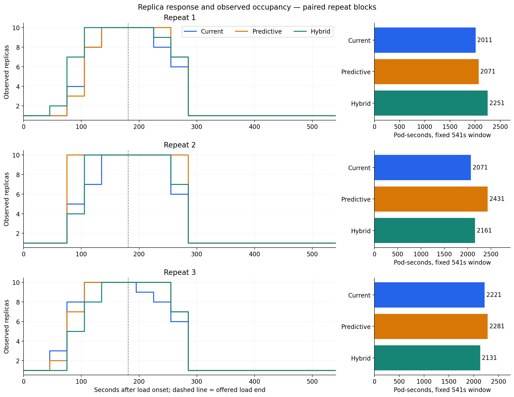

# 同控制器决策消融结果 — 2026-09-07

完成了两次重启后的容量复核，以及 Predictive、Current、Hybrid 各三次匹配 step 实验。
**这轮没有观察到 Current 或 Hybrid 的平均首次扩容更早，也没有证明整体服务优势。**
Current 的总 Pod-seconds 均值比 Predictive 少 7.1%，但成功率差异很小、样本只有三次，
三种模式均未达到预设的诊断服务标准。这是需要继续验证的资源占用观察。

代码已复现并保护“当前需求超标、较低预测抑制扩容”的具体决策路径。
规则在给定输入下有效，与真实环境中能否改善整体表现，需要分别用证据判断。
方法与取舍见[中文讲解](decision-mode-ablation-guide.zh-CN.md)，设计见
[实验协议](decision-mode-ablation.md)。

## 主要结果

均值 ± 样本标准差，每种模式 **n=3**；未做显著性或非劣效检验。

| 指标 | Current | Predictive | Hybrid |
|---|---:|---:|---:|
| HTTP 200 成功率 | 69.85 ± 8.29% | 68.68 ± 7.52% | 68.40 ± 8.51% |
| 首次成功提高 Scale 目标（秒） | 48.67 ± 17.90 | 48.67 ± 17.04 | 48.33 ± 16.74 |
| 首次采样副本增加（秒） | 65 ± 17.32 | 65 ± 17.32 | 65 ± 17.32 |
| 全请求 p95（毫秒） | 10000.67 ± 0.11 | 10000.62 ± 0.07 | 10000.64 ± 0.05 |
| 成功请求 p95（毫秒） | 3097 ± 2296 | 2967 ± 1575 | 1390 ± 590 |
| 总 Pod-seconds，541 秒窗口 | 2101 ± 108 | 2261 ± 181 | 2181 ± 62 |
| 负载后 Pod-seconds，360 秒窗口 | 1126 ± 46 | 1236 ± 52 | 1196 ± 17 |
| 首次采样缩容，距负载停止（秒） | 44 ± 30 | 84 ± 17 | 64 ± 17 |

每次均完成 4,498 个请求、丢弃 1 次迭代，峰值为 10 副本，最终回到 1 副本。
九次采样中的完全缩容时间均为负载停止后 104 秒；这是 15 秒网格上的观测，
不能理解成实际动作精确同步。没有缩容截尾，也没有排除或重跑任何控制器试验。

Current 相对 Predictive 的总占用均值少 160 Pod-seconds（7.1%），负载后少 110（8.9%）。
Hybrid 分别少 80（3.5%）和 40（3.2%）。成功请求 p95 在 Hybrid 中较低，但它只描述
成功的子集；所有组的全请求 p95 仍接近 10 秒超时上限，不能据此宣称整体延迟改善。

## 逐次结果与配对差异

以下按实际执行顺序列出。成功数的分母均为 4,498；每行均保留失败与超时。
“请求扩容”取成功 Scale 写入前后的**目标**副本差，排除同目标重复写入；
“观察扩容”取 Deployment 状态采样，二者均相对负载开始。

| 顺序 | 模式与重复 | HTTP 200 数 | 成功率 % | 请求扩容 s | 观察扩容 s | 总 Pod-s | 负载后 Pod-s |
|---|---|---:|---:|---:|---:|---:|---:|
| 1 | Predictive r1 | 2849 | 63.34 | 58 | 75 | 2071 | 1206 |
| 2 | Current r1 | 2970 | 66.03 | 59 | 75 | 2011 | 1116 |
| 3 | Hybrid r1 | 3519 | 78.23 | 29 | 45 | 2251 | 1176 |
| 4 | Current r2 | 2886 | 64.16 | 59 | 75 | 2071 | 1176 |
| 5 | Hybrid r2 | 2858 | 63.54 | 58 | 75 | 2161 | 1206 |
| 6 | Predictive r2 | 2942 | 65.41 | 59 | 75 | 2431 | 1296 |
| 7 | Hybrid r3 | 2853 | 63.43 | 58 | 75 | 2131 | 1206 |
| 8 | Predictive r3 | 3476 | 77.28 | 29 | 45 | 2281 | 1206 |
| 9 | Current r3 | 3570 | 79.37 | 28 | 45 | 2221 | 1086 |

按重复块配对，Current − Predictive 的总占用差为 −60、−360、−60 Pod-seconds；
成功率差为 +2.69、−1.25、+2.09 个百分点。Hybrid − Predictive 的占用差为
+180、−270、−150，成功率差为 +14.89、−1.87、−13.85 个百分点。
方向和幅度的波动必须与均值一起看；这些配对不是同时发出的请求或随机分配。

## 为什么规则保护生效，平均首次扩容却没有提前

新代码只切换送入共同策略的 CPU 信号：Predictive 用限幅预测，Current 用当前值，
Hybrid 用 `max(当前值, min(限幅预测, 目标值))`。默认仍为 Predictive。
预测计算、样本就绪条件、上下限、容差和稳定窗口均保留；资源事件仍可能触发额外协调，
相同的 30 秒重排队配置不等于每次实际协调严格相隔 30 秒。

现场日志给出两类不同情况：

- **预测确实会压制已有需求。** Predictive r1 在 +28 秒时当前 CPU 为 63.19%，
  预测为 50.48%，落入 50% 目标的容差区间而跳过扩容。r2 在 +29 秒时当前为 83.96%，
  预测约 45%，基础建议仍为一个副本。
- **当前观测自身也可能不足以触发扩容。** Current r1/r2 的早期当前值分别只有
  26.63%/42.03%；Hybrid r2 为 52.69%，仍在共同容差区间，r3 为 40.01%。
  这些情况下切换信号仍需等待后续数据。
- **保护在真实决策中也出现了。** Current r3 在 +28 秒时当前为 63.05%，预测为 53.51%，
  使用当前值成功提高了副本目标。若只针对这一次相同输入使用 Predictive 规则，预测会落入容差区间；
  这个局部规则判断不等于整个运行的反事实服务结果。

每种模式恰好各有一次较早、两次较晚的首次扩容，组均值因而接近。
低观测值可能与采集/计算窗口、协调相位或运行噪声有关；本轮没有隔离这些因素的贡献。
下一步更有依据的诊断是记录指标时间戳、查询返回时间和协调时间，核对信息何时到达，
然后再决定是否调整采样、容差或预测参数。

## 设计、环境与校准

使用同一个 PHPA 控制器，固定源提交
`e64e8719c640744f5e506dc31c33811137d38607`，九个捕获的控制器二进制 SHA256 均为
`c9beec307323d513cd578dea0a3f2997646df8de3ab07dd2a6f9991353965710`。
运行在专用 `kind-hpa-dev`：8 个虚拟 CPU、约 7.70 GiB 内存。应用、发压器与控制平面共享主机，
PHPA 为同一源码编译出的主机进程，集群内 PHPA manager 保持零副本。

各组固定 25 RPS，min/max 1/10，CPU 目标 50%，缩容窗口 60 秒，alpha 30%，
历史窗口 5 分钟、预测视野 30 秒。应用 request/limit 为 200m/500m CPU；
k6 request 为 500m CPU、512Mi 内存，内存上限 1Gi，无 CPU 上限；预分配/最大 VU 为 250/300。
应用与 k6 使用已固定 digest 的镜像，通过集群内 Service 发压并禁用连接复用。
镜像、配置、源码及逐次标识保存在原始元数据和[图表输入](assets/decision-mode-inputs-20260907.json)中。

最初预检发现节点启动标识变化、内存记录增加约 12 KiB，因而先做新校准：

| 固定副本 | RPS / 时长 | HTTP 200 | 全请求 p95 | 丢弃迭代 | 诊断标准 |
|---:|---|---:|---:|---:|---|
| 1 | 25 / 180s | 173/4499，3.8453% | 10000.66ms | 1 | 不通过，服务质量独立不达标 |
| 5 | 25 / 180s | 4501/4501，100% | 79.52ms | 0 | 通过 |

诊断标准为 HTTP 200 ≥99%、全请求 p95 ≤500ms、零丢弃。五个 Pod 的请求份额为
19.485%–20.507%。这支持该环境中 25 RPS 可在扩容后被承载，不是最大容量或线性扩展性的证明。

每次资源窗口从负载开始到计划停止后 360 秒，共 541 秒，按 15 秒采样作阶梯积分。
准备、请求排空、数据复制不扩大比较窗口；日志时间也不等于新 Pod 已能承接请求。

## 验证与保留的失败记录

- Linux 生成 CRD/DeepCopy，并同步 Helm 中的 CRD。Go/envtest 与 lint 通过。
  38 项基准脚本测试和 37 项分析测试完成验证；Linux 缺少 Node 而跳过的两项已在 Windows 补跑通过。
- 旧控制器在新增回归要求下停留于 1 副本，Hybrid 达到预期 2 副本；日志均保留。
  初次检查器构建的网络失败及测试辅助函数参数简化过程也保留在验证归档中。
- 代码规范和需求两方面审查均无遗留发现。修复了日志缺少对象类型、重复配置分支，
  以及误把“目标 3→2、观测仍为 1”计成扩容的时间统计问题。
- 独立解析复核了九次请求总数/分位数、模式身份、实际 Scale 方向、副本积分，
  并验证 4,231 个封存文件的校验和与清单完整性。九次试验零排除、零提取警告。
- 共有两次发压前的预检/初始化停止：节点记录失配，以及固定镜像后旧 Pod 尚未退出。
  校准后的首次恢复检查也因旧 Pod 尚未退出而失败；独立后续复核确认完整配置和现场已恢复。
  原始失败记录与校验清单未改写，后续只补充有时限的初始化/收尾等待。

最终现场检查在 `2026-09-07T08:56:06Z` 确认原 Deployment/Service/CRD UID 与规格、
原 HPA/PHPA 规格已恢复，应用为一个就绪且非终止中的 Pod，无 k6 Pod，manager 为零。
策略重建后的 UID 会变化。冻结源码保持干净，旧 VM 工作区的 dirty-file 清单保持一致。

原始数据保存在 VM 与本机 `benchmark-runs/decision-ablation-20260907/delivery/`，
四份归档区分正式实验、预检尝试、校准与源码支持，共 4,567 个文件；传输校验均通过。
归档标识、图表输入及摘要见[可追溯输入文件](assets/decision-mode-inputs-20260907.json)。

证据取回并独立验证后，于 `2026-09-07T09:15:33Z` 移除了本次唯一临时 SSH 公钥，
其他授权项保留；本机两份临时私钥及公钥文件也已删除。访问清理回执单独保存，
未改写已经封存的执行归档。

## 结论边界

本轮仅为单一 step 场景、每组三次的描述性对照。轮换顺序不能消除共享主机竞争、
测量相位和负载反馈；“成功率相近”也不等于证明服务非劣效。
九次均有丢弃迭代且全请求 p95 饱和，没有一种模式达到诊断服务标准。
Pod-seconds 表示采样副本占用，不是 CPU 消耗或账单。
这些数据不支持宣称预测收益、整体性能优势或直接外推到 ramp/spike 和生产环境。
