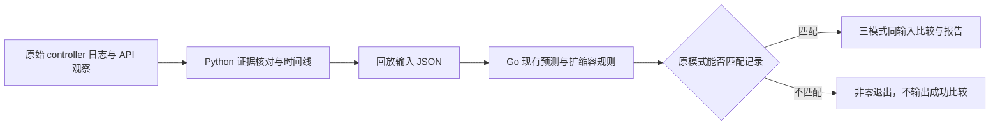

# 同输入回放：我做了什么，为什么这样做

我这次补了一条从原始实验记录到可解释决策的离线分析路径：Python 恢复输入、核对身份与时间线，Go 复用现有预测和扩缩容规则，把 Current、Predictive、Hybrid 放到同一组已记录条件下比较。它回答“这一轮为什么没扩容，以及换一种规则会建议什么”。结果与具体数字见[实测报告](decision-replay-20260911.md)。

我没有在这一步调整默认参数，因为上一次实验同时出现了两种现象：有的运行当前 CPU 已经较高，但预测偏低；有的运行连当前 CPU 都还很低。只有先区分输入和规则的作用，后续优化才有明确的检验对象。

## 两个公开入口如何配合



[Python CLI](../../hack/analyze/decision_replay.py)负责从完整原始 run 提取已验证输入：检查 PHPA 与 Deployment UID、PHPA generation 和配置、源码与二进制标识、协调前缀、样本数量、事件顺序，以及每次成功 Scale 写入与 API 读取是否相容。分析器从 controller 启动开始读取，保留暖机和拒绝事件，避免把“负载开始前已有的状态”误当作不存在。

[Go CLI](../../cmd/replay/main.go)负责命令行输入、退出码和 JSON 输出；[回放逻辑](../../internal/controller/replay.go)直接调用生产代码中的预测器、信号选择、方向保护、缩容稳定和跳过规则。回放没有创建 Kubernetes 客户端，输入文件不会触发线上扩缩容。

这种分工的优点是让记录解析和策略计算各有一个清楚的边界。若把完整控制器复制到 Python，短期写起来方便，但以后改 Go 的容差、方向保护或稳定窗口时，分析公式可能悄悄过时。若让回放真的写 Kubernetes，则同输入比较会被新 Pod、指标反馈和调度时序打断，也无法只依靠保留文件复现。

独立核对仍然有价值。本轮另有一条不导入生产分析模块的核对路径，检查历史恢复、预测算术与写入链。它用来发现共享实现可能遗漏的问题，不作为另一套长期生产策略。

## “同输入”到底固定了什么

每条回放决策固定以下内容：

| 输入 | 作用 |
|---|---|
| `at` | 原记录的稳定规则求值时间，保证窗口与冷启动判断可复现 |
| `currentCPU` | 该轮真实接受的当前 CPU 利用率 |
| `samples` 或 `rawPrediction` | 完整 CPU 历史，或明确标记为沿用的记录预测值 |
| `observedReplicas` | 当时观察到的实际副本状态，用于容量公式 |
| `requestedReplicas` | 当时已经成功提交的副本目标，用于方向与重复写入保护 |
| `config` | 目标 CPU、副本范围、EWMA 与稳定窗口参数 |
| `expected` | 该轮原模式的真实记录，用于比较前核验 |

三种模式各自维护自己的推荐历史，互相不共享峰值。比如 Predictive 曾经建议较少副本，这个建议不能成为 Hybrid 的缩容稳定历史。每种模式的下一轮仍读取该次实验真实记录的 observed／requested replicas；我不会把回放算出的目标偷偷接成下一轮真实副本。

这样能公平地问：“在这些已记录输入下，策略差异在哪里？”代价是它不构成完整的闭环模拟。真实地提前增加一个 Pod，会影响每 Pod CPU、Ready 时间、后续缺失指标检查及请求分配；仅凭旧记录无法计算那些新输入。把假想目标反馈下去，却继续使用原始 CPU，会混合两条不同世界的状态，容易得出没有证据支持的性能数字。

## 为什么要区分完整历史和记录预测值

现有历史管理并不只是把每条日志按时间排序。正常间隔形成持久锚点；频繁事件可能只替换这一轮返回历史的尾部，而不覆盖存储锚点。分析器按照这套语义恢复序列，并逐轮核对样本数量。把每次观测都永久追加，会改变 EWMA 的权重与预测结果。

初始日志只有“接受了一个样本”，没有打印这个样本的 CPU 值。我把它作为未知值一直保留到窗口过期，因此 607 条决策分成两类：

| `predictionSource` | 数量 | 已验证的内容 |
|---|---:|---|
| `computed-history` | 457 | 输入历史完整，可以重新运行预测器，再验证原模式策略结果 |
| `recorded-forecast` | 150 | 保留日志中的预测值，只验证该预测值之后的策略行为 |

这种保守处理会减少可声称“独立重算预测”的数量，但没有编造观测。填零、插值、丢掉最早样本或从最终预测反推初值，都可能让结果看起来完整，却掩盖原始证据的缺口。

拒绝观测也不能一律当作零 CPU，更不能直接删除所有历史。分析器沿用现有指标提供者的语义：短暂不完整数据等保留已验证历史，需要失效的错误清空历史；缺失数据本身没有资格进入预测。启动前缀、拒绝原因、时间顺序或原模式结果矛盾时，命令会失败，避免带着错误状态继续比较。

## 一个“目标是 2 却没有扩容”的例子

step Predictive r3 的首轮记录是：当前 CPU 为 91.28%，预测 CPU 为 50.65%，目标 CPU 为 50%，实际与请求副本均为 1。

现有 [决策代码](../../internal/controller/scaling_decision.go)先选择决策信号，再计算并约束副本建议，应用稳定规则，最后判断是否允许写入。Predictive 选用 50.65%，公式约为 `ceil(1 × 50.65 / 50) = 2`；可是相对目标只偏离约 1.31%，仍在 10% 容差带内，于是输出 `finalDesired=2`、`skipReason=WithinToleranceBand`，没有 Scale 写入。

Current 选用 91.28%。Hybrid 在这个当前需求较高、预测更低的场景中也选用当前信号，两者输出目标 2 且不跳过。回放因此明确指出了这次等待发生在什么规则上。它没有说明“第 28 秒已经多出一个 Ready Pod”，更没有计算新 Pod 带来的成功率变化。

输出中把各阶段拆开，是为了避免只看最终整数目标：

| 字段 | 读法 |
|---|---|
| `rawPrediction`／`boundedPrediction` | 预测原值，以及安全限幅后的值 |
| `decisionCPU` | 该模式实际用于决策的 CPU 信号 |
| `formulaReplicas` | 副本公式与范围约束的结果 |
| `directionClamped` | 方向保护是否进一步改变了公式建议 |
| `desiredReplicas` | 进入缩容稳定规则之前的建议 |
| `stabilized`／`coldStartProtection` | 前者表示缩容建议实际被抬高；后者只表示初始保护期仍有效，不表示本轮扩容被阻止 |
| `finalDesired`／`skipReason` | 最终目标，以及这一轮是否跳过写入 |
| `historyEntries`／`historyOldestAt` | 用于解释稳定窗口的推荐历史 |

初始保护和缩容稳定规则不能只凭名字理解为“这段时间禁止扩容”。需要看该轮方向、最终目标与跳过原因，才能解释它是否真的约束了本次动作。

## 时间线能测到什么，哪里仍然未知

Python 报告把负载零点、源样本、查询起止、观测完成、决策、成功 Scale 响应和 Ready 读取区间放到同一个相对时间轴。报告中的 `replay_index` 可将某个有决策的协调关联到三模式输出；没有决策的拒绝周期仍然保留。

我有意分别表达精确记录边界、采样区间和未知区间：查询耗时由开始与结束计算；源样本年龄由观测完成时间减源时间计算；Ready 变化只能由前后 API 读取边界约束。源时间没有给出 cAdvisor 刷新或 scrape 的完整过程，Ready 也没有给出第一次 Service 请求的处理时间。

本轮 281 次拒绝分成查询前 175 次与查询后 106 次。次数能说明哪些协调走到了查询边界，但不能换算成拒绝持续了多少秒。两个协调间的空白也只能标为未观察区间；如果没有中间样本，不能断言缩短周期一定能拿到更早、更高的 CPU。

请求副本链从最初 Deployment 的 `spec.replicas` 开始，按成功 Scale 响应向前推进，再与有界 API 读取核对。它比只看 controller 日志多了一层约束，但依然无法排除两次 API 读取之间有外部写入后又恢复原值的情况。报告公开保留这项边界。

## 如何运行，以及如何判断成功

只比较公开紧凑输入，直接在仓库根目录执行：

```bash
go run ./cmd/replay -input docs/benchmarks/assets/decision-replay-20260911/20260910_195936_step_phpa_r3/replay-input.json
```

Go CLI 默认也支持标准输入，`-input -` 表示读取 stdin。它的退出码约定是：

| 退出码 | 含义 |
|---:|---|
| 0 | 原模式校验通过，标准输出给出 `verified=true` 的比较结果；帮助命令也返回 0 |
| 1 | 原模式结果与记录不符，或结果输出失败 |
| 2 | 参数、文件或输入证据结构无效 |

从完整原始 run 生成时间线与比较时，先构建回放二进制，再运行 Python CLI：

```bash
go build -o bin/replay ./cmd/replay
python3 -m pip install -r hack/analyze/requirements.txt
python3 hack/analyze/decision_replay.py benchmark-runs/live-baseline-20260910/verified-baseline/matched-step/runs/20260910_195936_step_phpa_r3 --output benchmark-runs/decision-replay-reproduction/r3 --replay-binary bin/replay
```

Windows 下将二进制路径改为 `bin/replay.exe`，并使用本机已配置的 Python 命令。`--output` 必须不存在；重复分析时换一个目录，保留此前结果与回执。

不传 `--replay-binary` 时，分析器只准备输入和时间线，报告是 `prepared-only`，不能声称原模式已经匹配。传入二进制并校验成功后，报告变为 `recorded-decisions-matched`，同时生成 `replay-result.json`。`timeline.csv` 将逐次协调的时间与解释展开为表格；经过回放时也加入三模式的最终目标和跳过原因，便于逐行对照，JSON 仍保留完整结构。Python 命令成功返回 0，证据矛盾、回放失败、输出已存在等错误返回 2，并把原因写到标准错误。

公开紧凑文件足以复现规则比较；从原始请求重算服务指标、检查所有 UID 与日志边界，仍需要完整原始基线证据。文件哈希证明文件内容对应关系，不会替代缺失的原始内容。

## 我如何验证这条路径

本轮按约定把红绿测试放在两个真实命令行边界：Go 回放 CLI 的输入、退出码和输出，以及 Python 分析 CLI 的输入、退出码和报告。Go 测试通过子进程运行命令入口，因此也能发现只测内部函数时容易遗漏的命令行协议问题。

测试覆盖的用户可观察行为包括：完整历史重算、缺失历史显式降级、原模式不匹配时拒绝输出成功比较、目标身份被替换、出现日志外请求副本变化、丢失策略前缀、时间顺序矛盾、短暂指标缺口、频繁事件返回尾部，以及保留已有输出目录。它们检查的是“错误证据会不会被误发布成可信结论”，而不是逐行复写实现。

既有控制器测试继续检查复用规则之后的真实协调行为；607 条原模式决策匹配与独立核对则提供真实记录的回归证据。命令行测试通过不能替代 Linux API／envtest 的验证，离线重放也不能替代新的 Kind 服务实验。最终测试运行结果应以本轮提交随附的实际验证记录为准。

## 下一步为什么只改协调周期

当前证据已经证明“策略有时会压低已看见的突增信号”，也说明“有些首次输入无论换哪种模式都不足以扩容”。我选择先固定 Current 来研究后者，减少预测平滑对解释的干扰，然后仅比较 30 秒与 15 秒协调间隔。

直接同时缩短 rate 窗口、增加抓取频率、修改预测参数，可能让图表变好，却无法分清是哪一项起效。只缩短协调间隔的实验更容易回答：中间是否存在有用的新信号，以及多查询一次能否转化为服务收益。它仍可能失败，例如额外协调拿到的是相同旧值、指标不完整，或者新增容量未能及时服务请求。

下一轮计划在独立 Kind 环境校准后执行三个配对、六次 step pilot，以同一容差控制负载相对已观察新源样本的偏移，保留实际相位、有效新观测、拒绝时长和查询数量，并联合比较 HTTP 成功率、p95、丢弃及副本时间。该实验尚未执行，本轮参数保持不变。

如果面试中需要概括这项工作，我会这样说：

> 我给扩缩容控制器补了离线同输入回放与时间线核对。先验证 18 次实验中的原模式决策，再用同一份真实输入比较三种策略，区分已看见高 CPU 却被规则延后的决策，以及输入本身还不足的情况。607 条决策里，457 条能重算完整预测，150 条因为初始 CPU 日志缺失，只验证记录预测之后的规则。我据此设计了协调周期的单变量实验，但没有把离线建议当作已经实现的服务性能提升。

这段经历的技术价值在于：能把一个偏晚的扩容结果追到输入、规则、API 写入和容量观察的不同边界，并说明证据在哪一步不足，从而决定下一轮应该测什么。
