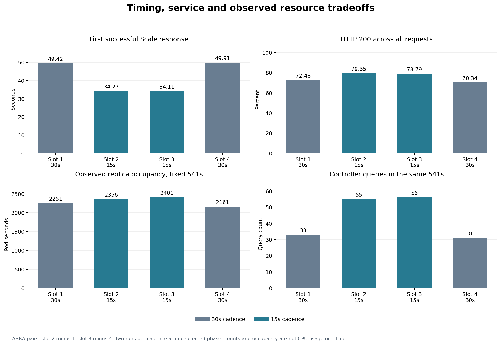
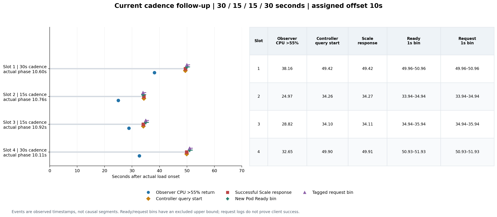

# 协调周期 30／15 秒匹配对照 — 2026-09-07

四次预先冻结的 Current 对照全部完成。**15 秒组观察到更早首次扩容和更高
HTTP 200 成功率，同时副本占用和查询次数增加。** 两组全请求 p95 仍接近
10 秒，且指标超过阈值的时间也有差异，不能把全部扩容提前量归因于协调间隔。
按[预先记录的协议](latency-cadence-followup.md)，默认值保持 **30 秒**。

这项验证来自[先前六次时序诊断](latency-diagnostic-20260907.md)中两次 10 秒
偏移的重复等待。新对照重新运行 30 秒组，使用同一二进制，按 **30／15／15／30**
秒顺序执行，目标启动偏移均为 10 秒。每组 **n=2**，没有与旧六次数据混为
同一组样本。实现与方法取舍见[中文讲解](latency-diagnostic-guide.zh-CN.md)。

## 逐次数据与代价

时间相对实际 k6 场景的负载起点。查询次数与副本占用都在相同的实际 541 秒
窗口内统计，包含事件触发的额外协调。每次完成 4,498 个请求，丢弃 1 次迭代。

| 顺序 | 间隔 | 首次提高 Scale 目标（秒） | HTTP 200 | 全请求 p95（ms） | Pod·秒 | 控制器查询 |
|---|---:|---:|---:|---:|---:|---:|
| 1 | 30s | 49.423 | 3260 / 4498（72.48%） | 10000.65 | 2251 | 33 |
| 2 | 15s | 34.268 | 3569 / 4498（79.35%） | 10000.52 | 2356 | 55 |
| 3 | 15s | 34.110 | 3544 / 4498（78.79%） | 10000.73 | 2401 | 56 |
| 4 | 30s | 49.908 | 3164 / 4498（70.34%） | 10000.77 | 2161 | 31 |

描述性组均值如下，差值为 15 秒组减去 30 秒组：

| 指标 | 30 秒 | 15 秒 | 差值 |
|---|---:|---:|---:|
| 首次成功提高 Scale 目标 | 49.666s | 34.189s | −15.477s |
| HTTP 200 成功率 | 71.410% | 79.068% | +7.659 个百分点 |
| 541 秒副本占用 | 2206 Pod·s | 2378.5 Pod·s | +172.5（+7.82%） |
| 负载后 360 秒占用 | 1123.014 Pod·s | 1145.447 Pod·s | +22.433（+2.00%） |
| 541 秒控制器查询 | 32 次 | 55.5 次 | +23.5（+73.44%） |

第 2 次减第 1 次，扩容提前 15.155 秒，成功率高 6.870 个百分点，增加
105 Pod·秒和 22 次查询。第 3 次减第 4 次，对应为提前 15.798 秒、成功率高
8.448 个百分点、增加 240 Pod·秒和 25 次查询。两对方向一致，幅度仍需逐次看。

全请求 p95 仍处于约 10 秒的超时水平，不能把微小的数值差异解释成整体延迟
改善。成功请求子集的 p95 不能替代全请求结果；丢弃的迭代另行报告，不计入
已执行请求的 4,498 分母。Pod·秒是采样副本占用，不是 CPU 消耗或账单。

## 为什么不能把 15.48 秒都归因于协调周期

15 秒组首次独立观测到 CPU >55% 的平均时间为 **26.897 秒**，30 秒组为
**35.403 秒**，信息也平均早了 **8.506 秒**。从这次响应到扩容查询开始的
有符号间隔，均值由 **14.256 秒**降为 **7.286 秒**，差 **6.970 秒**。
这些是时间线上的观测差，不是分别隔离的因果贡献。

| 配对（15s − 30s） | 信息首次超阈值 | 信息响应至查询开始 | 首次 Scale 响应 |
|---|---:|---:|---:|
| 第 2 次 − 第 1 次 | −13.188s | −1.967s | −15.155s |
| 第 3 次 − 第 4 次 | −3.825s | −11.973s | −15.798s |

第一对扩容提前主要与更早的信息可见同现，第二对则有较大的后续等待差。
这些信息差异发生在首次扩容之前，不能由该次扩容带来的新增 Pod 解释。

实验只主动改变了正常重排队配置，但匹配控制器的启动偏移，并不等于固定了
底层采样相位、信息可见时间或共享主机的所有波动。ABBA 顺序可以平衡早晚位置，
不能替代随机化；这两个重复也不足以估计普遍效果。结果与更早获得查询机会
相容，但没有证明全部约 15.5 秒都是减少协调等待的独立收益。

图中查询使用**开始**边界，Scale 使用成功响应边界。Ready 与 Apache 请求
接收时间按一秒桶显示，右端不包含。例如第 2 次的 Ready／请求存储值为
+33.941 秒，Scale 响应为 +34.268 秒；[33.941, 34.941) 的同一秒覆盖了
该响应，不能把表面上的 −0.327 秒解释成负启动时间。服务端请求日志也不
证明对应客户端避免了超时。

## 配置、检查与可追溯性

冻结源提交 `32568c1cd6a2543bcc525b75abd41365bff5d6d2`，四份实际控制器
二进制 SHA256 均为
`e6bb645479cd79948e981322b25cc9bb8f24d58ff0655ec6c3b069c820bf4771`。
两组各有一个预先冻结的配置指纹，Current 对象规格相同。元数据、观察器计划
和成功协调日志均核实了实际 15／30 秒设置，所有启动偏移均在 2 秒容差内。

25 RPS、min/max 1/10、CPU 目标 50%、缩容窗口 60 秒、alpha 30%、历史 5 分钟、
预测 30 秒、CPU rate 窗口一分钟、查询步长／实际采集间隔 15 秒、观察器间隔
2 秒，以及原有工作负载和发压器镜像／资源配置均保持匹配。应用仍无 HTTP
就绪探针，镜像已缓存；查询与协调次数不能直接换算为 CPU 负载。

共完成 1,301 个观察轮次。各运行的轮次耗时均值约 47.4–49.2ms，最大约
83.7ms；生产查询调用均值约 2.05–2.30ms。它们是墙钟调用时间，不是 CPU
开销。正常间隔减半后，事件触发的协调也参与计数，因此查询次数并非恰好翻倍。

配置 15 秒的公开协调回归先验证旧实现返回 30 秒而失败，再验证修复及默认
30 秒行为通过。显式无效参数在连接 Kubernetes 前拒绝。Go lint、完整
单元/envtest、45 项分析测试、14 项相关实验脚本测试和资源保护检查通过。
规范与需求审查均无遗留问题；冻结源码的 25 个 Go、模块和生成配置文件与
测试快照逐字节一致。

四次执行、采集和脚本恢复均成功。独立现场核验在
**2026-09-07T13:52:24Z** 确认原规格／受保护 UID 恢复，应用为一个就绪且
非终止 Pod，manager 为零，无发压 Pod 或本轮遗留进程；重建策略的 UID
会变化。既有 SSH 访问保留，先前六次的源码与封存证据未改动。

本批原始实验封存 443 个文件（不含其清单自身），交付归档包含 487 个文件，
传输、成员与解压后的逐文件校验通过。冻结分析代码重放一致；另一路不导入
项目分析器的复算完成 **112／112** 项比较，结果一致。记录、二进制与归档
标识见[可追溯输入](assets/cadence-inputs-20260907.json)。

## 最终决定

保留默认 **30 秒**，提供显式 `--requeue-interval=15s` 供复现实验与进一步
研究。本次观察到更早扩容和较高成功率，也观察到更多副本占用及查询；整体
p95 仍未改善到服务标准。一个特意选中的偏移、每组两次运行，不足以推动
全局默认值变更。按冻结范围结束本次验证，没有追加参数搜索或选择性重跑。
