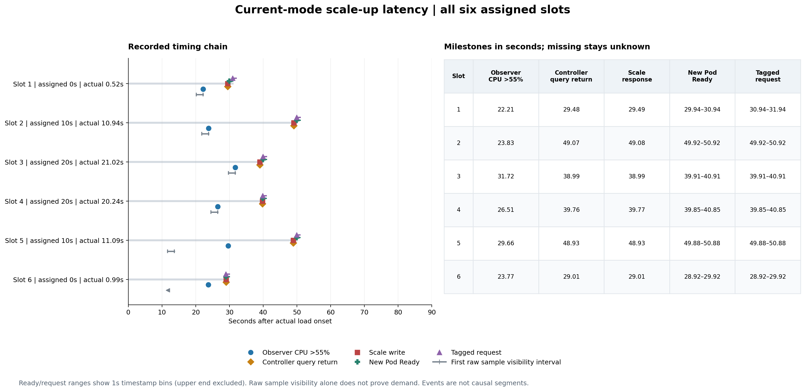

# Current 扩容时序诊断结果 — 2026-09-07

六次预先安排的 Current 运行全部完成，原始数据校验及独立复算通过。
**本轮把初始等待缩小到指标可见性与下一次协调两个环节；查询、决策和 Scale
写入本身只占毫秒级时间。** 这不是对各环节贡献的随机化因果估计。

首次独立观测到 CPU 超过扩容阈值，平均在负载开始后 **26.283 秒**；从该响应
到执行扩容的控制器查询开始，平均又过 **12.923 秒**，范围 **5.241–25.242 秒**。
因此不能说协调等待占总延迟的大头。它在 10 秒偏移下重复出现的额外等待，是
下一项单变量对照较明确的目标。

方法见[实验协议](latency-diagnostic.md)；实现、取舍与时间语义见
[中文讲解](latency-diagnostic-guide.zh-CN.md)。

## 逐次结果

以下按真实执行顺序列出。时间相对 k6 实际场景的负载开始，成功率分母每次均为
4,498 个已执行请求。目标偏移的两次重复分别处于正序与反序块；每种偏移只有
**n=2**，以逐次记录为主，不做显著性或非劣效声明。

| 顺序 | 目标 / 实际偏移（秒） | 首次独立观测 CPU >55%（秒） | 首次成功提高 Scale 目标（秒） | HTTP 200 | 541 秒 Pod·秒 |
|---|---:|---:|---:|---:|---:|
| 1 | 0 / 0.520 | 22.208 | 29.489 | 3282 / 4498（72.97%） | 2191 |
| 2 | 10 / 10.938 | 23.829 | 49.079 | 3013 / 4498（66.99%） | 2101 |
| 3 | 20 / 21.020 | 31.724 | 38.993 | 3333 / 4498（74.10%） | 2101 |
| 4 | 20 / 20.243 | 26.513 | 39.768 | 3392 / 4498（75.41%） | 2101 |
| 5 | 10 / 11.091 | 29.657 | 48.931 | 3167 / 4498（70.41%） | 2071 |
| 6 | 0 / 0.991 | 23.768 | 29.014 | 3440 / 4498（76.48%） | 2161 |

三种目标偏移的首次 Scale 均值分别为 **29.252、49.005、39.381 秒**。所有实际
偏移都在预先约定的 2 秒容差内，没有重分组、排除或重跑任何一次测量。

每次均丢弃 1 次迭代；全请求 p95 为 **10,000.62–10,000.79 毫秒**。六次合计
19,627 / 26,988 个 HTTP 200（72.7249%）。这些数据没有达到此前容量校准使用的
99% 成功率／500ms p95 标准。较早首次扩容或较少 Pod·秒不能单独证明整体效率。

图中的查询点使用返回边界；本文讨论“等待下一次查询”时使用查询开始边界，
两者相差实际查询耗时。Ready 与请求列表示一秒时间桶，右端不包含。灰色区间
表示原始样本首次可见的观测范围，箭头表示下界未知；原始样本出现不等于
CPU 已达到扩容阈值。图中事件间距不是已隔离的因果贡献。

## 证据如何缩小问题范围

### 1. 指标求值时间不等于源样本已及时到达

第 1 次运行中，第一条负载后的原始 CPU 样本时间为 +11.282 秒；观察器首次
看到它的区间是 (+20.201, +22.207] 秒。+20.2 秒的 CPU 表达式结果仍约为
0.012%，+22.2 秒才看到 61.571%。样本代表的时间、数据对查询可见的时间和
CPU 表达式求值时间不能合并。

实际 Prometheus 全局采集间隔为 15 秒，cAdvisor 任务沿用该间隔；历史查询
步长也是 15 秒，CPU rate 窗口为一分钟。它们分别控制不同阶段。本轮尚未将
cAdvisor 样本生成、Prometheus 抓取可见性与平均窗口的贡献分别隔离。

### 2. 两次 10 秒偏移都错过了足够信号出现后的早期时段

第 2、5 次运行在约 +19 秒协调时，CPU 仍未达到扩容条件。随后独立观测分别
在 +23.829 和 +29.657 秒超过 55%；执行扩容的下一次控制器查询却在约
+49.071 和 +48.925 秒开始。已观测到足够信号之后的间隔分别为 **25.242**
和 **19.268 秒**。

六次运行从扩容查询开始到 Scale 成功返回只耗时 **5.5–8.4 毫秒**。这支持
先验证协调周期，而不是把这些几十秒等待归因于查询请求或 API 写入缓慢。
独立观察器和控制器是不同调用，仍不能把它们当作同一份原子快照。

蓝线连接的是约两秒一次的独立求值，仅作视觉引导；红色点是控制器决策时使用的
当前 CPU。底部短线是已存储的源样本时间，不直接表示需求何时变化。资源事件
可能触发额外协调，因此不能把 30 秒重排队配置理解成严格定时器。

### 3. 副本监控曲线明显晚于 API 和请求证据

第 1 次 Scale 成功返回为 +29.489 秒，Deployment API 在 +30.245 秒前已
返回两个副本，15 秒 Prometheus 网格却到 +44.944 秒才显示增长。六次中，
这种网格显示与首次 API 响应的差为 **5.146–25.017 秒**；它不能全部算成
Pod 启动时间。

当前应用没有 readiness/startup 探针，镜像已缓存。Ready、端点就绪、Apache
请求接收和日志输出各有不同含义。第 6 次 Ready／请求存储时间看似比 Scale
响应早 0.097 秒，是秒级时间桶带来的表象，不能解释成负启动延迟。服务端
记下 HTTP 200 也不保证相应客户端没有超时，服务指标仍以 k6 为准。

## 方法、校验与现场恢复

固定源提交 `075e0564c1af741a9eceb3d36ec84482800239d7`，六个实际控制器
二进制的 SHA256 相同：
`1cd79edec246a656ef7b592cefdf475571f4ea6224e0cfc0fbfee69c30661ff7`。
Current、25 RPS、min/max 1/10、CPU 目标 50%、缩容窗口 60 秒、alpha 30%、
历史 5 分钟、预测 30 秒均固定。工作负载 request/limit 为 200m/500m CPU；
集群内 Service 发压，应用、控制平面和发压器共享专用 Kind 所在主机。

观察器完成 1,974 个采集轮次，没有请求错误或轮次超时。各运行的完整请求轮次
耗时均值约 45.1–52.6ms，p95 约 55.6–73.4ms；轮次开始间隔均值约 2.0003 秒。
这些是并发 I/O 的墙钟耗时，不是观察器 CPU 消耗，也不能证明观察完全无扰动。

查询与控制器回归经历失败后通过；项目要求的 Go lint、完整单元/envtest、
离线实验及分析测试通过。固定 k6 镜像在无网络条件下通过脚本加载检查。
规范与需求审查均无遗留问题。审查修复了容器重启后的日志连续性检查，以及
发压器初始化较慢时可能缩短实际观察窗口的问题。

六轮执行与恢复均成功。独立现场检查在 **2026-09-07T12:08:11Z** 确认原始
Deployment、Service、manager 和 CRD 规格／UID 恢复，HPA／PHPA 规格恢复，
应用为一个就绪且非终止的 Pod，manager 为零，无发压 Pod 或本轮遗留进程。
策略重建后的 UID 会变化。既有 SSH 访问未改动。

原始实验封存 611 个文件（不含其清单自身）；两份交付归档合计 669 个文件，
传输、归档成员和解压后的逐文件校验均通过。独立审计不导入项目分析器，完成
六次共 **138／138** 项原始数据复算比较；另一路重放冻结的分析代码，结果一致。
摘要及归档标识见[可追溯输入](assets/latency-inputs-20260907.json)。旧 VM 工作区
比较使用先前已封存的 dirty-file 清单，跨度更长，不宣称已证明其中未提交内容
逐字节不变。

## 单变量后续选择

根据两次 10 秒偏移下重复出现的等待，后续只验证 **重排队间隔 30→15 秒**。
保持默认 30 秒，以同一程序、同一偏移做匹配对照。选择它是因为等待位置清楚、
容易单独验证；不是因为协调占总延迟最大，也不是已经证明 15 秒会改善整体服务。
具体预先冻结的四次设计见[协调周期后续协议](latency-cadence-followup.md)。

后续四次已完成，逐次结果与限制见[协调周期对照报告](latency-cadence-followup-20260907.md)。
它们是另一个匹配批次，不与本报告六次合并计算处理效果。

本轮没有证明预测算法收益，也不能直接外推到其他负载、冷镜像启动或生产环境。
