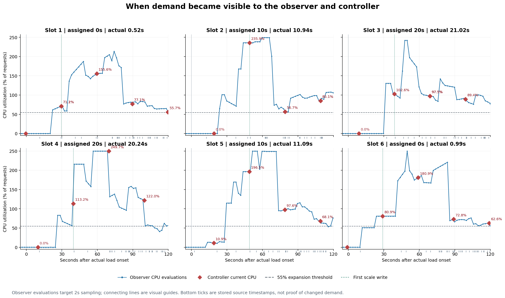

# 扩容延迟诊断：做了什么，为什么这样做

## 要回答的问题

上一轮三种决策模式的平均首次扩容都在约 49 秒。Current 已经直接使用当前 CPU，
仍有早扩和晚扩两类运行。因此，这轮先追踪需求信息什么时候到达、控制器什么时候
行动，以及新增 Pod 什么时候有承接请求的证据。

“当前 CPU”也不是瞬时读数。本项目用最近一分钟 CPU 累计量的变化率计算利用率，
历史查询结果使用 15 秒的求值步长，控制器通常在协调结束后 30 秒再排队。
本轮实际监控配置中的采集间隔也为 15 秒，但采集间隔与查询步长是两项不同的
设置。资源事件还可能额外触发协调。

## 实际改动

在一次协调的日志中加入共同的开始时间，保留 controller-runtime 的协调标识。
指标查询记录请求开始、返回、耗时、查询区间以及最后一个求值点。控制器在写入
Scale 或状态之前记录当前值、预测值、实际采用的信号、副本建议和跳过原因；成功
写入后再记录写入边界。结束记录包含错误和下一次重排队配置，提前返回也有记录。

这使得“做出了一个扩容建议”“成功提高了目标副本数”和“观察到副本增加”可以
分别核对。比如状态仍显示 1，但目标已经是 2，又写入一次 2，就不算第二次扩容。
如果 Scale 写入成功、后续状态更新失败，也不会丢失前面的成功证据。

预测公式、CPU 查询、默认 Predictive 模式、容差、稳定窗口和副本范围在本轮保持
原样。实验通过已有的 `decisionMode: Current` 选择当前值。

另加一个显式启用的实验观察器。它独立记录 Prometheus 原始序列、CPU 计算值、
Deployment、Pod、EndpointSlice 和每个 Pod 的访问日志。采集目标间隔为 2 秒，
每个请求有自己的起止时间；六个并行请求不被当作同一时刻的完整快照。

## 三种时间为什么不能混用

假设一条原始 CPU 样本的时间是 12:00:15，某次查询在 12:00:20 求值，
控制器在 12:00:21 收到结果。这三个时间分别回答：

| 时间 | 能回答的问题 | 不能据此认定的事情 |
|---|---|---|
| 原始样本时间 | 数据代表哪个采样时刻？ | 控制器此时就已能查询到它 |
| 查询求值时间 | 表达式计算的是哪个时刻？ | 底层所有数据也是这个时刻采集的 |
| 请求返回时间 | 这个调用最迟何时拿到了结果？ | 数据直到这时才首次进入 Prometheus |

上面的时间只是说明用的例子，不是本轮测量值。Prometheus 求值时间独立于底层
样本时间。若每两秒查看一次数据，首次查到某条样本只给出可见性的区间证据，
不能把它写成精确的入库时间，也不能断言另一个并发查询拿到完全相同的数据。

缩短查询步长主要改变返回的历史求值网格，不会自动加快底层采集。类似地，
本轮观察器每两秒查询一次，是为了缩小观测不确定性，不代表每两秒就产生一条
新的原始 CPU 样本。

一分钟 `rate` 窗口的含义是用一段历史估计变化率，不代表请求必须等满一分钟。
突增之后，窗口中仍有空闲阶段的数据；多快超过扩容阈值还取决于采样时刻、窗口
覆盖和负载强度。本轮 50% 目标加上共同的 10% 容差，向上阈值为 55%。

## 为什么安排六次 Current 实验

固定 25 RPS、相同镜像和资源配置、同一控制器二进制，安排偏移
`0、10、20、20、10、0` 秒。每种目标偏移有两次，执行顺序相反，便于观察
控制器在一个周期内何时遇到新负载。它仍是小规模诊断，不能消除共享主机噪声，
也不能替代随机化的大样本因果实验。

发压 Pod 先就绪，再等待指定时间开始运行。计时锚点选为一次负载前的成功空闲
协调：当前和建议副本均为 1、当前 CPU 低于 5%、重排队配置为 30 秒。安排一个
未来启动时刻，给控制命令传输留出时间；发压脚本仍保留原来的 30 秒安静阶段。

最终起点从 k6 的实际 `scenario.startTime` 获取，另外记录第一条请求尝试。
预定偏移和实际偏移同时保留。偏差超过预先约定的 2 秒会标记，超长协调间隔也会
单独标记，不通过重新分组或重跑把数据变得更整齐。

停止负载后继续观察完整的 360 秒，再留一个副本采样间隔。代码审查特意检查了
“发压器初始化耗时 40 秒”的情况：如果沿用进程启动时间计时，真实观察窗口
可能变短；现在收尾直接使用保留下来的实际场景时间。

## 为什么还要看就绪、端点和访问日志

提高副本目标只是请求 Kubernetes 增加实例。Pod 被创建后还要启动、达到就绪
条件，并进入可用服务端点。访问日志中的本轮标记提供新 Pod 确实收到这轮请求
的证据，排除健康检查和其他运行的流量。

本轮保留的工作负载配置没有 `readinessProbe` 或 `startupProbe`。所以它的
Ready 状态不能被解释为一次 HTTP 应用探测已经通过；访问日志提供了另外一层
请求证据。实验没有临时增加探针，以免同时改变被测应用的启动行为。

镜像在专用 Kind 节点上已有缓存。因此，本轮测到的启动过程不包含一次冷镜像
下载；即使本轮 Pod 很快就绪，也不能直接外推到不同镜像或生产环境。

Apache 请求接收时间只有秒级精度；容器日志前缀记录日志输出时间。服务端后来
记下 HTTP 200，也不保证客户端没在等待过程中超时。因此客户体验仍用 k6 的
成功率、全请求 p95 和丢弃迭代判断。

容器在跟踪期间重启会改变日志的连续性。观察器会检查每次快照的重启次数和
容器标识，把变化记成证据缺口，阻止这次采集被报告为完整成功。

Kubernetes 对象里的秒级时间戳还可能造成表面上的先后倒置。例如某个创建时间
记为 `12:00:29`，实际创建可能发生在这一秒内；Scale 请求的返回则可能是
`12:00:29.5`。两者并不矛盾。分析要保留时间精度，不能画出负的“创建耗时”。
同样，API 已报告副本增加但监控曲线稍后才更新时，两者的差是观测延迟，不能
全部算到 Pod 启动上。本轮的差值也不能用来直接修正旧实验中每一次的时间。

## 方法的优点和取舍

| 选择 | 优点 | 代价与其他方法的局限 |
|---|---|---|
| 同一控制器使用 Current | 减少决策模式的影响，便于追踪观测与调度 | 对比原生 HPA 会同时引入指标源、协调和策略实现差异；本轮不回答完整控制器谁更优 |
| 先补时间记录 | 能判断下一次改动应针对哪一段等待 | 会增加日志和观察负载；直接换预测模型无法单独检验信息到达是否及时 |
| 显式安排并记录启动偏移 | 可以检查运行结果是否随周期内启动位置改变 | 比直接连续发压更复杂；精确安排仍受初始化和额外协调影响，实际偏差必须报告 |
| 原始数据与逐次结果全部保留 | 可以复核结论、看到失败与波动 | 需要更多存储和分析工作；只保留均值会掩盖不同运行机制 |
| 一次只选择一个后续变量 | 下一轮变化较容易解释 | 探索速度较慢；同时改窗口、容差和算法，即使改善也很难判断原因 |
| 保留真实集群与回归测试两类证据 | 前者观察实际链路，后者固定验证规则和分析语义 | 单元测试不能证明真实时延收益，真集群小样本也不能保证规则边界始终正确 |

## 六次诊断告诉了我们什么

六次都按计划完成，实际启动偏差均在预设的 2 秒容差内。独立复算 138 项比较
全部通过，原环境已恢复。完整逐次数据见[结果报告](latency-diagnostic-20260907.md)。

首次独立观测到足够 CPU 平均耗时约 26.3 秒，之后等到执行扩容的控制器查询
开始又平均过了约 12.9 秒。查询开始到 Scale 成功响应只有 5.5–8.4 毫秒。
因此，这套环境里几十秒的初始等待，主要要从信息何时可见、何时再次协调去解释。

这并不意味着应该立刻改所有时间参数。两次 10 秒偏移中，已有足够信号后还
分别等待约 25.2 和 19.3 秒；这一段重复出现、边界清楚，适合单独验证协调间隔。
指标侧虽然耗时更长，但还混合了采样生成、抓取可见性和平均窗口，贸然选择某个
指标参数反而较难解释变化来自哪里。

图中蓝线是独立观察器的 CPU 求值，红点是控制器实际使用的当前值。第 2、5 次
在约 19 秒读取时还不足以扩容；蓝线随后超过阈值，下一次红点却接近 49 秒。
这就是选择下一项实验的直接依据，不是“调小一个数应该就更快”的猜测。

## 只验证一项配置：30 秒与 15 秒

后续增加 `--requeue-interval`，默认仍为 30 秒。使用同一二进制，在相同的
10 秒目标偏移下，按 30／15／15／30 秒顺序各运行两次。预测、指标查询、容差、
稳定窗口、负载和观察器不变，具体设计先记录在[后续协议](latency-cadence-followup.md)。

15 秒的候选会增加正常协调频率，因此还要看实际查询次数、服务失败和副本占用。
更短的 5 秒或 10 秒会增加更多轮询，本轮没有同时搜索多个值；这能减少事后
挑选最好结果的空间。两个重复和一个特意选中的启动偏移，也不足以决定全局默认值。

后续运行结束后，将在这里补入真实对照结果及其限制。

## 阅读与复现

- [实验协议与验收标准](latency-diagnostic.md)
- [Prometheus 查询时间语义](https://prometheus.io/docs/prometheus/latest/querying/basics/#staleness)
- [k6 场景时间](https://grafana.com/docs/k6/latest/javascript-api/k6-execution/)
- [k6 初始化与场景生命周期](https://grafana.com/docs/k6/latest/using-k6/test-lifecycle/)
