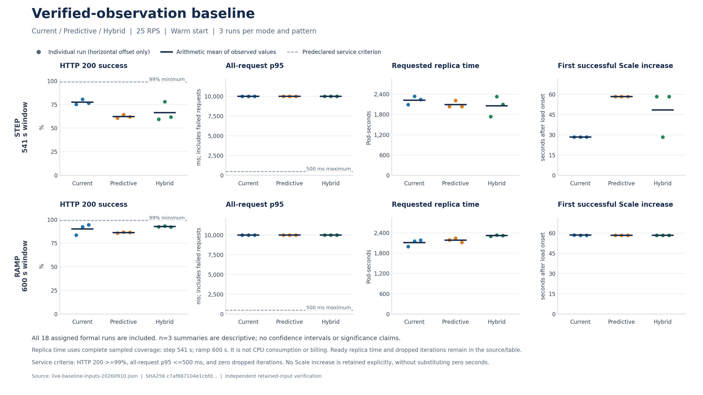

# 当前指标安全版本的性能基线：2026-09-10

**这轮完成了 step、ramp 各九次正式 warm 对照，18 次运行均完整收集并通过证据复核，但没有一次达到预先确定的服务标准。** 标准是 HTTP 200 比例至少 99%、全部请求 p95 不超过 500 ms、丢弃迭代为零。所有正式运行的 p95 都约为 10 秒；step 每次丢弃一次迭代，ramp 均为零。

在本环境的 step 负载下，Current 首次扩容较早、成功率较高；ramp 下三模式首次扩容均约 58.5 秒，没有观察到预测提前扩容。ramp 的 Hybrid 成功率均值较高，同时保留了更多副本时间。每组仅 n=3，这些结果描述本次配置与负载，不能给三种模式作普遍排名，也不能据此声称节省云费用。

**本轮不修改 30 秒协调周期、60 秒 CPU rate 窗口和默认 Predictive 模式，也不增加预测算法。** 新证据给出了后续诊断方向，尚未证明某项生产参数修改具有收益。



[SVG 图](assets/live-baseline-summary-20260910.svg)与[完整紧凑输入](assets/live-baseline-inputs-20260910.json)一并保留。每个点是一轮运行，短线是描述性算术均值，没有置信区间或显著性结论。

**如何读均值。** HTTP 200 均值先由每轮原始成功数除以请求数，再取三轮均值；p95 一列是三轮各自 p95 的均值，不是把全部请求合并后重新计算的 p95。表中最后才进行四舍五入。

| 负载 | 模式 | HTTP 200 均值 | 每轮 p95 均值（ms） | 请求 Pod-seconds | Ready Pod-seconds | 首次 Scale 增长均值（s） |
|---|---|---:|---:|---:|---:|---:|
| step | Current | 77.36% | 10000.66 | 2221.81 | 2214.47 | 28.44 |
| step | Predictive | 62.32% | 10000.71 | 2092.38 | 2081.04 | 58.49 |
| step | Hybrid | 66.37% | 10000.72 | 2052.48 | 2046.48 | 48.47 |
| ramp | Current | 90.15% | 10000.28 | 2111.36 | 2106.07 | 58.53 |
| ramp | Predictive | 86.33% | 10000.49 | 2182.05 | 2170.81 | 58.47 |
| ramp | Hybrid | 92.64% | 10000.22 | 2318.14 | 2310.82 | 58.46 |

相对同负载 Current，step 的 Predictive／Hybrid 请求副本时间分别减少 5.83%／7.62%，同时成功率更低；ramp 则分别增加 3.35%／9.79%。Ready 副本时间对应变化为 step −6.03%／−7.59%、ramp +3.07%／+9.72%。因此，副本时间较少本身不能作为优化成立的依据，必须同时说明未服务成功的请求。

**先证明负载和环境能够承载，再比较扩容。** 当前环境重新完成了 Service 分流与固定副本容量校准；25 RPS 的两个 90 秒校准分别产生 2250 个请求：

| 固定副本数 | HTTP 200／请求数 | HTTP 200 | 全请求 p95（ms） | 丢弃迭代 | 服务标准 |
|---|---:|---:|---:|---:|---|
| 1 | 165／2250 | 7.33% | 10000.83 | 1 | 未达到 |
| 5 | 2250／2250 | 100.00% | 81.78 | 0 | 达到 |

这支持用 25 RPS 观察“单副本承载不足、增加副本后可以承载”的扩容过程，不能保证自动扩容也能及时达到同样效果。正式批次前还有一次独立 Current warm 探索运行，用于确认收集和恢复链路；其成功率 74.34%、首次 Scale 增长 28.23 秒，未并入三次正式重复。

**本报告对应的冻结配置。** 正式批次从干净的 Linux Git checkout 构建并运行本地 controller 二进制，负载由独立 Kind 集群内的 k6 Pod 经 Service ClusterIP 发出。这里的性能结果没有验证 Dockerfile／Helm 部署路径。

| 项目 | 实际配置 |
|---|---|
| 性能实现提交 | `3ebbbf12729c7dc6070415c6d99abda2ac4b0def` |
| controller 二进制 SHA256 | `abc0181d1918f0d2299ebe79f050a916e084c6823025a5f202806d0b6001a27e` |
| 构建与集群 | Go 1.26.2，`go build -trimpath`；Kubernetes 1.35.0 |
| 采集与协调 | Prometheus 抓取 15 秒；CPU rate 窗口 60 秒；协调周期 30 秒；API 观察周期 2 秒 |
| 工作负载 | `hpa-example`；每 Pod CPU request 200m、limit 500m |
| 决策共同参数 | 目标 CPU 50%；副本 1–10；EWMA alpha 30%、horizon 30 秒、window 5 分钟；缩容稳定窗口 60 秒 |
| 请求生成 | k6 1.3.0；25 RPS；250 预分配 VU、最多 300 VU；关闭连接复用；请求超时策略 10 秒 |
| 计量窗口 | step 发压 181 秒 + 尾部 360 秒，共 541 秒；ramp 发压 240 秒 + 尾部 360 秒，共 600 秒 |

工作负载镜像固定为 `registry.k8s.io/hpa-example@sha256:581697a37f0e136db86d6b30392f0db40ce99c8248a7044c770012f4e8491544`，k6 固定为 `grafana/k6:1.3.0@sha256:a90b459a3768c46ad1013da53af24189f735d7112273c6ac3212ca8ed0e18656`。后续提交 `a4f2473` 只补强实验入口的保留 HPA 名称保护，没有改变本批次正在运行的冻结控制器、负载或参数。

三轮顺序固定为 Current→Predictive→Hybrid、Predictive→Hybrid→Current、Hybrid→Current→Predictive。全部已分配位置均保留，没有选择性替换结果。warm 放行要求有效历史至少两个样本、当前 generation 的 `MetricsReady=True`、初始保护结束且回到一个空闲 Ready 副本；这不等于已经积累了完整五分钟历史。负载零点来自 k6 实际场景起点加 30 秒静默期，而不是 shell 进程启动时刻。

**首次扩容为何不同。** step 的首轮有效协调都在负载开始约 28.4 秒后；同一轮日志同时保留当前 CPU、预测值、最终目标和跳过原因，因此可以区分规则行为与输入差异。

| step 位置 | 模式 | 首轮当前 CPU | 首轮预测 CPU | 实际结果 |
|---:|---|---:|---:|---|
| 2 | Predictive | 77.23% | 42.86% | 目标仍为 1；约 58.48 秒首次增长 |
| 4 | Predictive | 90.08% | 49.98% | 目标仍为 1；约 58.52 秒首次增长 |
| 9 | Predictive | 91.28% | 50.65% | 目标为 2，但命中容差带；约 58.47 秒首次增长 |
| 3 | Hybrid | 0.68% | 0.39% | 当前输入尚未越过目标；约 58.46 秒首次增长 |
| 7 | Hybrid | 33.66% | 18.68% | 当前输入尚未越过目标；约 58.48 秒首次增长 |

前三行直接说明本次突增输入被平滑预测及容差规则延后了一个约 30 秒的协调周期。后两行不能作相同归因：Hybrid 用于扩容的当前输入本身较低，对应源样本年龄约 28.02／21.74 秒。另一轮 Hybrid 首次看到当前 CPU 56.46%，就在约 28.48 秒扩容。没有对齐抓取与负载相位，不能把这些输入差异全部解释成决策模式差异。

首次 Scale 时间来自写入成功响应；Ready 容量增长只能给出前后 API 读取之间的观察区间。例如 step 第 1 次 Current 在 28.39 秒写入，首次观察到 Ready 增长的区间为 29.01–31.06 秒。二者都不能单独证明新 Pod 已经收到 Service 请求。

18 次正式运行的请求／Ready 副本时间均覆盖完整窗口，指标状态采样的未知时长也均为零；`MetricsReady=False` 的采样时长为每次 64.02–154.02 秒。日志显示首次扩容后部分协调因新 Pod 尚未 Ready 而拒绝数据。保守的数据完整性要求会影响后续决策机会，但本批次没有隔离各项检查、抓取和历史恢复分别贡献了多少等待。这里的时长是有界采样估计，不是连续、精确的状态转换时间。

**18 次正式结果全部列出。** 下表单位分别为百分比、毫秒、Pod-seconds、相对负载起点的秒；全部运行均未达到三项服务标准的组合要求。

| 负载 | 位置 | 模式 | HTTP 200（%） | 全请求 p95（ms） | 丢弃 | 请求 Pod-s | Ready Pod-s | 首次 Scale（s） |
|---|---:|---|---:|---:|---:|---:|---:|---:|
| step | 1 | Current | 75.10 | 10000.65 | 1 | 2091.08 | 2081.07 | 28.39 |
| step | 2 | Predictive | 60.72 | 10000.65 | 1 | 2033.09 | 2023.12 | 58.48 |
| step | 3 | Hybrid | 59.43 | 10000.73 | 1 | 1735.13 | 1729.14 | 58.46 |
| step | 4 | Predictive | 64.25 | 10000.68 | 1 | 2210.94 | 2196.89 | 58.52 |
| step | 5 | Hybrid | 77.92 | 10000.66 | 1 | 2327.14 | 2325.14 | 28.48 |
| step | 6 | Current | 80.55 | 10000.65 | 1 | 2333.19 | 2327.18 | 28.48 |
| step | 7 | Hybrid | 61.76 | 10000.78 | 1 | 2095.17 | 2085.16 | 58.48 |
| step | 8 | Current | 76.43 | 10000.67 | 1 | 2241.16 | 2235.17 | 28.46 |
| step | 9 | Predictive | 62.01 | 10000.81 | 1 | 2033.12 | 2023.12 | 58.47 |
| ramp | 1 | Current | 83.75 | 10000.62 | 0 | 1997.81 | 1991.91 | 58.60 |
| ramp | 2 | Predictive | 85.60 | 10000.52 | 0 | 2187.95 | 2176.13 | 58.45 |
| ramp | 3 | Hybrid | 92.44 | 10000.22 | 0 | 2302.13 | 2296.10 | 58.40 |
| ramp | 4 | Predictive | 86.82 | 10000.48 | 0 | 2238.09 | 2228.20 | 58.48 |
| ramp | 5 | Hybrid | 93.31 | 10000.13 | 0 | 2334.08 | 2322.14 | 58.49 |
| ramp | 6 | Current | 92.31 | 10000.22 | 0 | 2152.13 | 2146.13 | 58.48 |
| ramp | 7 | Hybrid | 92.15 | 10000.32 | 0 | 2318.22 | 2314.23 | 58.49 |
| ramp | 8 | Current | 94.40 | 10000.01 | 0 | 2184.16 | 2180.16 | 58.49 |
| ramp | 9 | Predictive | 86.57 | 10000.48 | 0 | 2120.12 | 2108.11 | 58.50 |

**cold 单次观察的准确边界。** 另行保留的一次 Current cold step 成功率为 64.34%，首次 Scale 增长为 57.558 秒。controller 启动后 32.8969 秒负载才开始：启动后约 30.4069 秒已有两个可用历史样本，并在负载前 1.7518 秒观察到 `MetricsReady=True`。初始缩容保护仍持续到负载后约 57.5115 秒。

因此，这次 `cold` 只证明没有等待 warm 放行门槛；它没有测到“空历史时立即到来的负载”，也不能用与 warm 均值之差估计重启代价。缩容保护也不是禁止扩容的定时器，不能因首次扩容接近其结束时刻就认定由它阻止扩容。该运行与前面的独立探索运行都未并入正式 n=3 均值。

**为什么现在保留默认参数。** Current 在 step 的表现为“避免平滑预测压低已出现的突增输入”提供了具体证据；ramp 未显示提前扩容，且所有模式都未满足服务标准，所以目前没有充分依据把某一模式升级为默认生产策略。简单缩短协调周期也可能重复读取同一源样本，增加 API／Prometheus 工作，而未解决输入可见性与缺失指标保护带来的等待。

下一步应先按源样本时间对齐负载相位，并回放同一 CPU 历史比较三种规则；随后才对协调周期或 rate 窗口做单变量实验，同时记录查询次数、有效样本数、拒绝决策时长、服务结果和副本时间。本轮没有执行该优化实验，也没有已经验证的新算法收益。方法和替代方案见[实现讲解](live-baseline-guide.zh-CN.md)。

**证据复核与复现范围。** 原始归档共 1,718 个文件已核对完整性；独立脚本重新计算了 18 次正式运行的 HTTP 计数、p95、丢弃、成功 Scale 边界和副本积分。第二条独立复核路径中，正式比较部分包含 6,375 条状态观察和 571 条接受观测的源样本年龄；连同源码／对象边界及单次 cold 检查，全套共 28,633 项检查、零不一致。这些是证据一致性检查数量，不是统计样本量；正式比较仍为每组 n=3。

```text
原始归档：baseline-evidence.tar.gz
字节数：52630594
SHA256：a431b9cb19bd8f7a1be6291e27304a3343ee3642649251ba7f441de18b2cc59e
完整性清单 SHA256：3ab13f9d352cd5e42d080558ff91f4ee91162dc07fe5f8fbf7f231b1dca7f4ca
```

完整原始文件和独立复核回执保存在忽略目录 `benchmark-runs/live-baseline-20260910/`。[公开完整性清单](assets/live-baseline-integrity-20260910.json)列出归档内 1,718 个文件的相对路径、字节数和 SHA256；拿到归档后可以逐项核对，清单本身不包含原始请求内容。仓库中的紧凑输入与[公开绘图 CLI](../../hack/analyze/plot_live_baseline.py)足以重新生成图表和逐次结果表；从请求逐点重新计算 p95、核对 UID 和原始日志，则仍需要上述完整归档，不能仅凭这张图完成。

绘图使用 Matplotlib 3.10.1；它需要单独安装，原始分析的依赖文件目前不包含绘图依赖。

```bash
python3 -m pip install matplotlib==3.10.1
python3 hack/analyze/plot_live_baseline.py docs/benchmarks/assets/live-baseline-inputs-20260910.json --check-only
python3 hack/analyze/plot_live_baseline.py docs/benchmarks/assets/live-baseline-inputs-20260910.json --overwrite
```

归档完成后，按原始 namespace UID `9d9c3193-451f-4f3a-a416-0783f3638d5f` 和节点容器身份核对并删除了本轮专用性能集群；原有共享集群 UID `5ef8888a-dfe3-4b9b-b247-731010abe051` 保持不变。清理回执与性能归档分别保留。

另行运行的当前 Dockerfile／Helm 故障验收已于 2026-09-11 完成：第 9 次入口运行通过全部 11 项功能检查，诊断和清理无错误，前八次失败全部保留。该批次使用固定镜像缓存、5 秒抓取和独立集群；它验证交付与故障行为，不能替代本页的性能结果，也不能作为全冷缓存或托管 CI 已通过的证据。完整结果见[真实入口验收报告](../metrics-safety-entry-validation-20260911.md)，复现见[工作流说明](../metrics-safety-workflow.md)；离线回归与代码审查见[验证记录](live-baseline-validation.md)。
