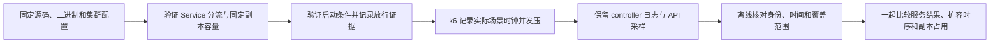

# 当前指标链路的性能基线：实现与复现实验讲解

这一轮把“控制器实际接受了什么数据”“负载真正何时开始”“扩容写入后何时观察到容量增加”接到同一条可复查的时间线上。同时，把已有指标安全验收接入当前 Dockerfile 和 Helm 部署路径。

本文解释实现、复现入口和判断方法。各次真实运行是否成功、具体数值和本轮最终结论由单独的实测报告记录；脚本存在、离线测试通过、真实集群验收通过以及性能改善，是四件需要分别提供证据的事。实现范围见[本轮规范](live-baseline-followup.md)。

## 为什么先重建基线

指标安全改造后，Provider 通过 Kubernetes 对象身份校验 CPU 数据，控制器在当前进程内积累有效观测，并为新 leader 建立缩容保护。旧实验中的历史查询、采样时机和启动条件已经不能代表这条代码路径。

这意味着，即使旧脚本仍能画出 CPU 曲线，也可能没有回答“这一轮协调实际看到了哪一个样本”。因此本轮先补实验输入、启动条件和观测证据，再决定是否需要调整算法。指标归属检查本身的原理见[指标安全中文讲解](../metrics-safety-guide.zh-CN.md)。

整个链路可以这样读：



## 1. 让 controller 日志证明输入已经被接受

[观察器](../../hack/observe_live_baseline.py)读取 controller 的结构化日志，并采样目标 Deployment、PredictiveHPA 和 Pod 状态。它保留每类 API 请求的开始和结束时间，采集失败也保留收据。

CPU 输入时间线来自同一轮协调中的查询、决策和完成记录。例如，`sourceTimestamp` 表示底层源样本时间，`observationFinishedAt` 表示 Provider 完成本次观测的时间。二者相减，才是接受该观测时源样本已经有多旧。假设源样本来自第 95 秒、观测在第 100 秒完成，样本年龄就是 5 秒；Prometheus 在第 99 秒执行查询，并不会把源样本变成 1 秒前采集的数据。

这种方法的优点是可以直接对应决策代码和实际 Scale 写入。旧的 Pod 名字前缀查询更容易实现，也适合初步查看趋势，但可能把同名前缀的其他 Deployment、旧 Pod 或不符合当前身份校验的数据放进曲线，不能证明 controller 接受过这些数据。

代价是实验工具需要理解结构化日志字段，并且必须保留原始日志，防止日志格式变化后悄悄算错。因此分析器会校验日志与启动证据是否一致；缺少必要证据时返回失败，不猜一个时间继续计算。

## 2. 把启动条件变成可核对的门槛

warm 运行在发压前需要同时满足：

- 目标 Deployment 和 PredictiveHPA 的 UID 与本轮绑定的对象一致，决策模式一致。
- controller 最近一轮协调成功，查询和决策记录都表明已有至少两个有效样本。
- 当前 generation 的 `MetricsReady=True`。
- 初始冷启动保护已结束，目标回到一个已请求、实际存在且 Ready 的副本，空闲 CPU 低于 5%。

满足后，观察器写出 `live-baseline-gate.json`，其中包含放行时刻和对应的完整协调记录。分析器会再次用 `controller.log` 核对这条记录。

“已有至少两个样本”是当前预测器可工作的最低历史门槛，并不表示已经积累了整个 `prediction.window` 长度的历史。实验仍须记录样本数、参数和启动年龄，避免把不同历史长度笼统叫作同一种稳态。

固定等待 30 秒或 60 秒写起来很方便，但它把“时间过去了”当作“数据和容量已经就绪”。当镜像启动、采集或 API 变慢时，这个假设会失效。现在的门槛能给出具体的未就绪原因，也会在超时后停止；代价是准备阶段耗时会变化，需要单独记录这部分时间。

cold 运行使用另一条启动分支：记录 controller 启动时刻和对象身份，不等待上述 warm 门槛。随后仍按已定义的 k6 场景发压。因此，**cold 参数表示没有等待 warm 门槛，并不保证流量到来时 controller 仍然没有历史**。场景包含 30 秒静默段，实际是否处在历史积累期，要结合 controller 启动至负载开始的间隔、有效样本数和首次有效观测判断。cold 数据与 warm 对照组分开保留和解释。

## 3. 用实际场景时钟对齐负载与扩容

[baseline.js](../../hack/k6/baseline.js)复用已有 step/ramp 负载形状，并从 k6 的实际 scenario start time 写出场景时间标记；每次请求还记录相同的场景时钟。分析器交叉核对这些标记。

| 阶段 | step | ramp |
|---|---|---|
| 场景启动后的静默期 | 30 秒 | 30 秒 |
| 计划发压区间 | 1 秒上升、179 秒保持、1 秒下降，共 181 秒 | 60 秒上升、120 秒保持、60 秒下降，共 240 秒 |
| 发压结束后的观测尾部 | 360 秒 | 360 秒 |

时间零点是实际场景开始后 30 秒的计划负载起点。它不等于 shell 启动 k6 的时刻，也不等于第一个请求完成的时刻。镜像拉取、Pod 调度和 k6 初始化都可能发生在场景开始之前。

扩容链路里也要区分两种精度：

- `first_scale_increase_seconds` 来自 controller 收到 Scale 写入成功响应后的记录，表示副本请求已经成功发出。
- `first_observed_ready_growth_interval_seconds` 来自前后 API 读取，只能给出观察到 Ready 容量增长的时间区间。它不是精确 Pod 启动耗时，也不能单独证明新 Pod 已经接到 Service 流量。

因此，“写了 5 个副本”与“已经有 5 个可用副本”应分别展示。把二者合并，会掩盖调度、启动、就绪和流量接入之间的等待。

## 4. 缺失观测保持未知，副本占用和服务质量一起读

[离线分析器](../../hack/analyze/live_baseline.py)分别计算已请求副本和 Ready 副本的时间积分。例如，一个可观测的 10 秒区间内请求了 3 个副本、仅有 1 个 Ready，分别得到 30 requested Pod-seconds 和 10 Ready Pod-seconds。

这只是副本数量的采样积分。它没有测量 CPU 实际用量、内存占用或云账单，也不能据此直接声称节省成本。当前主分析窗口从负载起点到完整的 360 秒尾部结束；warm 准备阶段的占用没有被混进这个窗口，其耗时要通过启动记录另行阅读。

默认观察周期为 2 秒。相邻成功读取之间的间隔超过允许范围，或遇到失败读取、缺失条件、旧 generation 的状态，相关区间会保留为 `Unknown`。分析器同时输出已覆盖部分、未知秒数和未知区间；覆盖不完整时，不把局部积分包装成完整的 `pod_seconds`。缺失尾部等必要证据还会使分析直接失败。

同样，`MetricsReady=False` 的采样时长与未知时长分开报告。没有采到状态，不能说明控制器一直正常，也不能说明它一直拒绝决策。Deployment 和 PredictiveHPA 读取也不是一个原子快照，因此原始收据保留各自的请求区间。

读结果时需要把这些量放在一起：

| 量 | 回答的问题 |
|---|---|
| HTTP 200 比例、全请求 p95、丢弃迭代 | 用户请求是否得到服务，压测器是否漏发了目标请求 |
| 首次 Scale 增长、随后 Ready 增长区间 | 请求容量和获得可用容量分别等待了多久 |
| requested / Ready Pod-seconds | 在指定窗口内保留了多少副本容量 |
| 源样本年龄、有效历史、MetricsReady 状态 | 扩容前是否在等待可接受的输入 |
| 未知时间和失败收据 | 这些结论实际有多少观测支持 |

只看成功请求的延迟，可能把超时请求排除；只看 Pod-seconds 较少，也可能奖励一个没有及时扩容、损失大量请求的方案。正式对照计划预先写入服务标准：HTTP 200 比例至少 99%、全请求 p95 不超过 500ms、丢弃迭代为零。这是本轮实验的判断标准，不能外推成所有系统的通用标准。

## 5. 固定对照顺序，把失败也算作已分配的运行

[campaign 入口](../../hack/run_live_campaign.py)一次安排一个负载形状下的九个 warm 运行，顺序固定为：

| 轮次 | 第一个 | 第二个 | 第三个 |
|---|---|---|---|
| 1 | Current | Predictive | Hybrid |
| 2 | Predictive | Hybrid | Current |
| 3 | Hybrid | Current | Predictive |

它一次构建私有的 controller 二进制，记录源码与二进制 SHA-256，并在运行之间检查源码、二进制、集群、监控配置、工作负载和预期 fixture 身份。正式运行期间不要修改相关源码或配置。

每个已分配位置都有状态和证据路径。运行、采集、分析或状态恢复出现问题，就保留失败记录并停止后面的运行；不挑一个好看的重跑结果覆盖原位置。“没有观察到扩容”也保留为一种结果，不凭空补一个扩容时刻。

轮换顺序可以减轻固定执行顺序带来的偏差，无法消除共享主机、温度、缓存和外部干扰。每种模式三次仍然是小样本，适合描述本环境、本负载下的现象，不足以证明普遍优势。

Current、Predictive、Hybrid 使用同一控制器路径，主要改变决策信号，因此适合判断预测信号和组合规则的作用。直接先比较原生 HPA 会同时引入其采集、缺失指标、就绪处理和控制周期差异，解释成本更高；可以在同控制器对照可靠后，再把原生 HPA 作为整体方案基线。

## 6. 当前公共入口如何使用

下面是 Linux 上的入口示例。先准备新的独立 Kind、独立 kubeconfig、`default/php-apache` Deployment/Service、PHPA CRD，以及 `monitoring` namespace 中的采集组件；Prometheus 需要通过该独立集群的端口转发供本机 `localhost:9090` 访问。负载请求由集群内 k6 Pod 发往 Service。环境准备和最终删除集群由实验执行者负责，campaign 不创建或删除集群。

分析依赖见 [requirements.txt](../../hack/analyze/requirements.txt)。下面的 25 RPS 是待验证的候选值；只有当前环境的容量校准支持它时，才用于正式对照。每次输出使用新目录。

```bash
export BENCHMARK_CONTEXT=kind-phpa-live-baseline-my-run
export KUBECONFIG=/absolute/private/path/baseline.kubeconfig
export BENCHMARK_PYTHON=python3

# 先查看离线计划；不会操作集群。
PROBE_REPLICAS='1 5' PROBE_RPS_LIST=25 PROBE_DURATION_SECONDS=90 \
  bash hack/run_calibration.sh --dry-run
python3 hack/run_live_campaign.py --plan --pattern step --rps 25

# 确认目标没有竞争的 HPA/PHPA 后，校准分流与固定副本容量。
PROBE_REPLICAS='1 5' PROBE_RPS_LIST=25 PROBE_DURATION_SECONDS=90 \
  CALIBRATION_ROOT=benchmark-runs/my-calibration \
  bash hack/run_calibration.sh

# 独立的 Current 探索运行，先验证收集和清理链路。
LIVE_BASELINE=true LIVE_BASELINE_STARTUP_MODE=warm RPS=25 \
  EXPERIMENTS_ROOT=benchmark-runs/my-pilot \
  bash hack/run_benchmark.sh step phpa_current 1
```

单次入口会在 `EXPERIMENTS_ROOT` 下创建带时间和模式名称的子目录。探索运行与正式组分开；开始正式组前，需要按探索运行的对象身份妥善处理其遗留 PHPA。正式 campaign 默认要求目标没有 PHPA，不会自动接管一个仅仅同名的资源。

```bash
# 一个 step 组：三种模式各三次，按预分配顺序执行。
python3 hack/run_live_campaign.py --pattern step --rps 25 \
  --context "$BENCHMARK_CONTEXT" --kubeconfig "$KUBECONFIG" \
  --output benchmark-runs/my-step

# step 完整结束后，再运行 ramp；明确引用上一组留下的资源身份。
python3 hack/run_live_campaign.py --pattern ramp --rps 25 \
  --context "$BENCHMARK_CONTEXT" --kubeconfig "$KUBECONFIG" \
  --expected-phpa-receipt benchmark-runs/my-step/terminal-state.json \
  --output benchmark-runs/my-ramp

# cold 使用独立目录，继续按其真实启动年龄解释。
LIVE_BASELINE=true LIVE_BASELINE_STARTUP_MODE=cold RPS=25 \
  EXPERIMENTS_ROOT=benchmark-runs/my-cold \
  bash hack/run_benchmark.sh step phpa_current 1

# 单次运行的离线复算；run-directory 换成入口实际打印的目录。
python3 hack/analyze/live_baseline.py /absolute/path/run-directory \
  --output /absolute/path/new-analysis.json
```

`--expected-phpa-receipt` 只用于引用上一组的完整 `terminal-state.json`，并校验目标与 namespace 身份；它不是跳过身份检查的开关。每组内逐次分析由 campaign 自动执行，结果保存在该组的 `analysis/` 下。分析不访问集群，已有输出也不会覆盖。

## 7. 把功能验收接到真实交付路径

性能实验使用本机启动的 controller 进程，便于逐次冻结二进制、重置进程状态和完整采集日志。交付路径则另外验证：当前 Dockerfile 构建镜像、加载到新 Kind、Helm 安装两个 manager，再执行已有的 11 项指标安全检查。

```bash
python3 hack/run_metrics_safety.py \
  --cluster-name phpa-metrics-safety-my-run \
  --output benchmark-runs/metrics-safety-my-run
```

这个入口自己创建并清理集群。它核对 Docker、containerd 和 manager Pod 的镜像身份，检查同名前缀隔离、滚动更新、实际 CPU 扩容、leader 接替保护以及 Prometheus 中断恢复。配置和使用边界见[故障验收工作流说明](../metrics-safety-workflow.md)。

与临时编译二进制再包装 scratch 镜像相比，走当前 Dockerfile 和 Helm 能覆盖真实依赖下载、镜像入口、运行用户、RBAC 和双副本选主配置；代价是构建和部署更慢，也会暴露镜像仓库不可用等交付故障。此类失败保留原始收据，不能算成功验收。

清理同样属于实验结果。入口用私有 ownership 文件的挂载、节点容器 ID 和集群 UID 判断资源归属；身份变化时拒绝删除，失败时保留私有恢复目录。kubeconfig 不进入上传的证据目录。GitHub workflow 在成功和失败时上传证据，但工作流配置提交到仓库不等于已经在 GitHub 托管 runner 上跑通过。

## 接下来如何判断是否值得优化

先看等待主要出现在哪里：有效源样本迟到、历史还没就绪、协调已经看见数据但没有写 Scale，还是 Scale 已经写入但 Ready 容量迟到。然后提出一个能被单变量实验检验的假设。

例如，只有证据显示主要等待发生在协调时机，才值得比较另一个协调周期，并同时测量额外查询与副本占用。如果瓶颈在 Pod 启动，增加预测模型复杂度未必有效。复杂预测器还有训练数据、参数敏感性、运行开销和错误解释的成本；当前这轮先让较简单的策略能够被可靠观察和公平比较。

面试中可以用这样的顺序讲述：先解释旧基线为什么失效，再说明如何绑定真实输入和对象身份，如何定义启动条件和时间精度，最后拿实测报告展示服务结果与资源代价。结论始终限定在实际执行和可复核的证据范围内。
