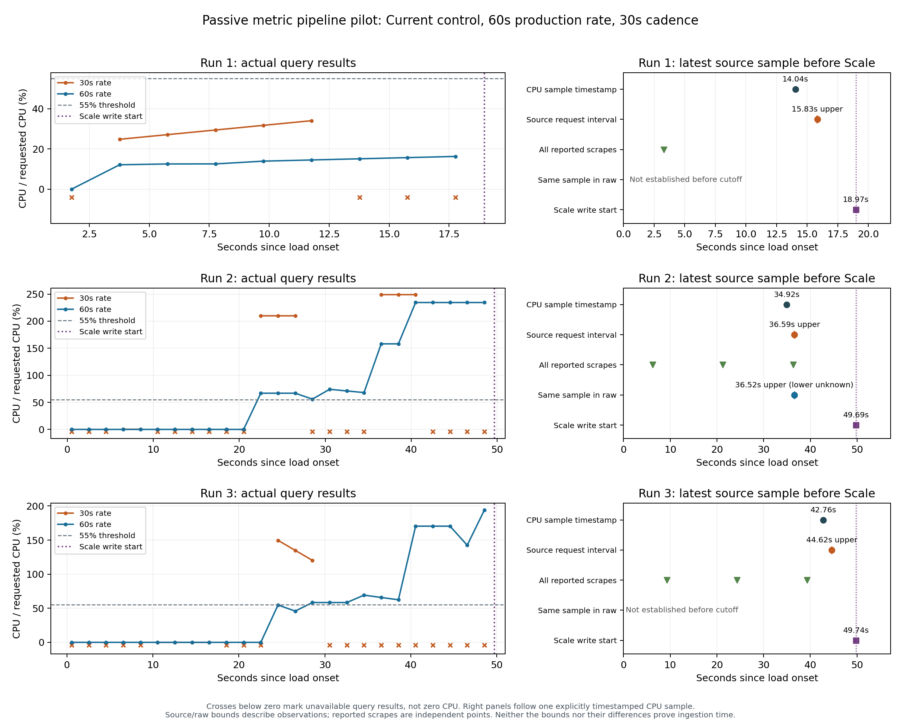

# 指标采集链路与 CPU 窗口旁路对照 — 2026-09-08

**本轮保留一分钟生产 CPU rate 窗口和 30 秒协调间隔。** 三次 Current 运行中，
扩容前的 59 个共同求值周期有 39 次三十秒表达式返回空向量，一分钟表达式
全部有效。能比较首次超阈值时间的两轮中，一轮同时越线，一轮短窗约早 4 秒。
这不足以支持修改控制参数；源端与抓取证据同时说明，信息可见性仍值得优先调查。

本轮新增了源端、实际抓取状态和多窗口观察，按[实施协议](metric-pipeline-followup.md)
完成了三次小规模现场诊断。原始数据、脚本、校验摘要与逐条记录索引见
[可追溯输入](assets/metric-pipeline-inputs-20260908.json)，实现与方法取舍见
[中文讲解](metric-pipeline-guide.zh-CN.md)。

## 环境与实验范围

源码固定为 `e41e52e4fa4a1036dd27b31f4e03f136ba355862`。三轮使用同一控制器
二进制、同一 Current 策略和配置指纹：25 RPS step，min/max 1/10，目标 CPU
50%，稳定窗口 60 秒，协调间隔 30 秒，启动偏移请求值 10 秒；30 秒 quiet、
181 秒 step、360 秒负载后观察。实际相位及偏差均保留，没有按结果补跑。
控制器保持原来的历史序列查询；30/60 秒旁路值不参与副本决策。

首次校准检查发现内核已从 `7.0.0-30-generic` 升至 `7.0.0-31-generic`，超出
原重启检查的允许范围，因此在发压和资源修改前退出。失败记录完整封存，
HPA/PHPA 原 UID 保留。随后建立独立 `kernel31` 批次，核对完整节点快照，
只接受记录中的精确内核、启动标识和内存变化，其余配置与运行时变化仍拒绝。
没有把这次拦截当成一轮服务实验，也没有据此选择性重复不好的服务结果。

新环境先完成两次 25 RPS、90 秒、Service 路径的固定副本校准：

| 固定副本 | 总请求 / HTTP 200 | HTTP 200 比例 | 全请求 p95 | Dropped |
|---|---:|---:|---:|---:|
| 1 | 2250 / 271 | 12.04% | 10000.94 ms | 1 |
| 5 | 2250 / 2250 | 100% | 73.93 ms | 0 |

五个 Pod 均有本次标记请求证据；这两个测试点确认了当前试验负载的适用性，
没有估计精确最大容量。新批次与旧内核批次分别保留，不合并为性能效果估计。

## 实际窗口结果

主范围从 k6 实际场景起点加 30 秒开始，截止于第一次成功提高目标副本的
Scale 写入开始。只使用求值时间不早于负载起点、且已在截止前返回的观察。
所有相关 raw 快照只有一个匹配 CPU 序列，CPU request 观测值均为 0.2 core。

| 运行 | 扩容前周期数 | 30s 有效 / 空 | 60s 有效 / 空 | 30s 首次 >55% | 60s 首次 >55% | 首次 Scale 写入开始 |
|---|---:|---:|---:|---:|---:|---:|
| r1 | 9 | 5 / 4 | 9 / 0 | 未观测到 | 未观测到 | 18.971s |
| r2 | 25 | 8 / 17 | 25 / 0 | 22.509s | 22.509s | 49.691s |
| r3 | 25 | 7 / 18 | 25 / 0 | 24.554s | 28.554s | 49.735s |
| 合计 | 59 | 20 / 39 | 59 / 0 | — | — | — |

首次越线列使用共同查询的求值时刻，完整请求区间另保留。r1 的最后一次旁路
求值在 +17.766s，随后控制器使用 63.48% CPU 扩容。两个“未观测到”表示
截止前的观察没有捕到阈值事件，不能解释为从未越线，也不能补成零秒。

三十秒窗的 39 次空结果均对应同轮 raw 快照不足两个窗口内样本；一分钟窗
没有这一情况。窗口左开右闭，边界上的旧样本不能计入。39/59 是本轮采样中
空向量的比例，既不是 59 次独立试验，也不是 HTTP 失败率或长期可靠性估计。
两条独立查询即使使用同一求值时间，也不保证看到原子的 TSDB 快照。

旁路使用真实 Prometheus instant query，控制器仍使用 `query_range` 获取历史
序列。因此这些结果也不能直接变成假想短窗控制器的错误率；若未来修改窗口，
还须检验缺失或较旧末端样本的处理，并通过闭环实验确认服务影响。

橙色为 30s，蓝色为 60s；下方叉号表示无可用值，不是负 CPU。右图固定跟踪
每轮扩容前源端最新的 CPU 时间戳，绿色是独立抓取报告时间。源端和 raw 的
标记来自不同请求；raw 先被某次查询看到，也可能早于我们自己的源端观察。
这些点、请求区间和可见上界不能相减为精确入库耗时。

## 源端已出现，raw 查询仍未看见

另用预先固定的取例规则检查：选择最先出现的、负载后源端样本，要求源端
已经返回后，至少一条不重叠的合格 raw 查询仍缺少相同节点、标签、时间戳和
counter 值；再列出截止前最后一条这样的缺失观察。三轮均有符合条件的记录。

| 运行 | 源样本时间戳 | 源端响应结束上界 | 后续 raw 请求开始 | 该 raw 最新时间戳 | 原始 NDJSON 行号：source / raw |
|---|---:|---:|---:|---:|---:|
| r1 | 14.036s | 15.832s | 17.766s | 2.992s | 691 / 697 |
| r2 | 11.671s | 12.584s | 20.509s | −1.854s | 669 / 704 |
| r3 | 9.644s | 10.619s | 22.554s | −0.966s | 659 / 716 |

时间均相对实际负载起点，负时间戳表示负载前样本。源端返回至后续缺失查询
开始的观察间隔分别约 1.935、7.925、11.935 秒。它们表明两个访问入口的
可见性存在差异，不足以拆分网络、采集、缓存和存储提交各自的因果耗时。
源端读取是观察器自己的请求，也不是 Prometheus 的一次原生抓取。

在负载后的源端响应中，每轮观测到 3/4/4 个不同 CPU 时间戳，包括还在返回
的负载前基线样本；相邻不同时间戳的观测间隔范围分别为 11.044–19.529、
10.082–13.525、10.610–19.946 秒。源端响应结束时样本年龄最大分别为
18.365、13.675、18.969 秒。这不是精确 CPU 更新延迟，却说明两秒一次读取
不会自动得到两秒一次的新 CPU 统计。

主范围捕到的不同抓取报告有 2/4/4 个（其中各一个报告时间早于负载起点），
相邻报告时间相差 15 秒，健康状态均为 up，lastError 均为空；返回的 `up`
历史也未出现 0。故本轮没有观察到抓取失败。有限轮询和保留历史不等于完整
失败日志，不能证明所有内部步骤始终无异常。

实际 Prometheus 为 3.11.3，配置保留源时间戳。该版本的抓取报告时间可能
经过对齐，报告更新还先于 TSDB commit；`lastScrape + duration` 不能当成
入库完成时间。具体源码语义及 cAdvisor `last_seen` 与 CPU 时间的区别见
[中文讲解](metric-pipeline-guide.zh-CN.md#实现怎样把证据串起来)。

## 服务表现与观察开销

| 运行 | HTTP 200 / 总请求 | HTTP 200 比例 | 全请求 p95 | Dropped | 541s 副本占用 | 负载后副本占用 |
|---|---:|---:|---:|---:|---:|---:|
| r1 | 3820 / 4499 | 84.91% | 10000.54 ms | 0 | 2161 Pod·s | 981.272 Pod·s |
| r2 | 3173 / 4498 | 70.54% | 10000.74 ms | 1 | 2041 Pod·s | 1144.848 Pod·s |
| r3 | 3226 / 4498 | 71.72% | 10000.77 ms | 1 | 2071 Pod·s | 1144.857 Pod·s |

副本占用由原始 `prom.json` 的 15 秒采样作左阶梯积分，时间窗来自实际 k6
场景，不能视为精确逐 Pod 生命周期。三轮均未达到 99% HTTP 200 / 500ms p95
的服务标准。这里没有改变控制策略的对照组，不能宣称窗口修改改善了服务。

完整观察期共 987 个周期，执行 4935 次 PromQL 查询及共 6909 次指标采集
请求（另含 targets/source；该数不包括其他 Kubernetes 资源观察和控制器请求）。
指标请求没有采集错误，周期平均墙钟耗时 73.78ms，最大 438.88ms，没有周期
超过两秒。墙钟耗时不是 CPU 开销；没有 observer-off 对照，不能声称新增观察
对负载没有影响。

## 验证、恢复与决定

- 69 项完整分析测试、49 项完整实验脚本测试通过；Linux 边界和语法验证通过，
  133 个源码、模块与配置文件与冻结源码逐字一致。实现和操作脚本的独立审查
  发现问题后均已修复并复核，详见[审查记录](metric-pipeline-review-20260908.md)。
- 取回后验证 572 个归档文件；六份完整 seal 均核对通过。没有覆盖封存输入。
- 主分析与独立 raw 解析的 6513 个可比字段核对一致；另有 18 项覆盖缺口明确
  列出，没有称为全覆盖。独立链路解析补查了节点一致、匹配数量、抓取历史和
  逐行例子；独立服务及最终状态审计 38 项全部通过。
- Deployment、Service、HPA、PHPA、CRD 的完整 spec 恢复一致，manager 为 0，
  应用恢复到一个 Ready 副本，压测生成器和本轮拥有的进程均已停止。本轮未
  写入旧用户工作区，前后 dirty-file 列表相同；这不等于对已有脏文件内容作了
  逐字审计。既有 SSH 访问未改动。

独立审计也暴露过自身的假设：初次未解析控制器的 console 日志外壳，产生了
33 项差异；补齐真实日志格式后复算一致。校准 p95 的初次比较则没有考虑报告
保留两位小数，修正比较精度并保留未舍入值后通过。两次均未重跑负载或修改
原始实验资料，初始对比输出也保留。

本机交付位于 `benchmark-runs/metric-pipeline-20260908-kernel31/delivery/`：
两份 VM 证据归档对应 572 个文件，`analysis-support.tar.gz` 另保存 80 份实际
使用的复算脚本、初始/修正输出、测试记录和图表，并有独立清单与摘要。复算
使用补充包中的 `analysis-tools/`，原冻结实验支持脚本保持原样。

本轮完成了观测能力、实际旁路比较和小规模验证。采用新增诊断工具，保留
一分钟窗口和 30 秒协调间隔。后续应先研究怎样稳定提供足够新鲜的源样本，
再验证候选窗口及缺失/陈旧数据处理；本轮不具备直接进入短窗参数优化的依据。
