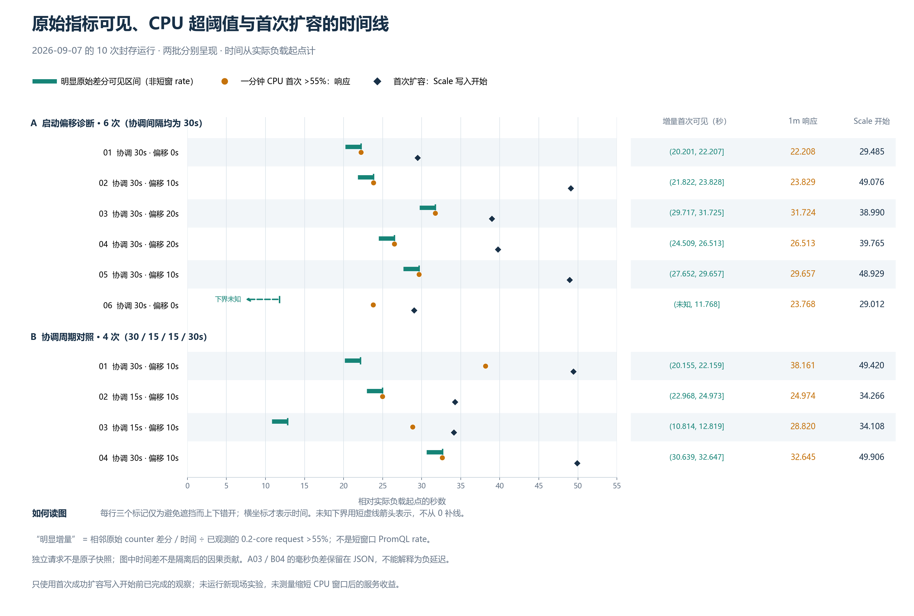

# 指标可见性与一分钟 CPU 窗口诊断 — 2026-09-08

本轮先修复了稳定窗口历史在长期不缩容时持续累积的问题，再复算 9 月 7 日
已封存的十次 Current 运行。**三个运行出现了“近期 CPU 增量已明显升高，
一分钟表达式仍未过阈值”的观测；同时，短窗口的样本充足性存在明显问题。**
这些结果缩小了调查范围，没有验证修改 CPU 窗口后的服务效果。

本轮采用[事先写下的分析范围](metric-visibility-diagnostic.md)，全部纳入六次
时序实验（offsets）和四次协调周期实验（cadence），两批分别保留身份。
这是基于已有证据的回顾分析，未追加现场负载。代码、证据和方法的教学说明见
[中文讲解](history-metrics-guide.zh-CN.md)。

## 历史清理修复

旧控制器每次决策都保存副本建议，只有准备缩容时才清理过期记录。
现在每次有效决策都维护滚动窗口；只有缩容时才采用窗口最大建议保护副本。
修复提交为 `48d1db6`。新增日志分别给出策略求值时间、最早保留记录时间和
保留条数，策略时间不与测量 API 耗时的墙钟混用。

公开 envtest 回归用 FakeClock 推进十二个 15 秒间隔，分别检查长期达到副本
上限和持续建议扩容。旧逻辑在第 75 秒仍保留第 0 秒的记录，两种场景都失败；
修复后通过。再跨过两个完整窗口，首次新决策只保留一条记录。三种决策模式
都验证了精确窗口边界仍保护副本、边界后一秒允许缩容。

这个修复限制的是历史覆盖时间，记录条数仍取决于窗口内的协调次数；事件触发
的额外协调也会记录。扩大配置窗口不能找回已清理的数据，重启历史恢复是另一项
设计问题。

## 近期增量与一分钟表达式

主分析截断于首次真实提高目标副本的成功 Scale 写入的**开始**时间。只使用在
此之前已经返回的原始观测，避免新增 Pod 分摊 CPU 后的变化干扰首次反应分析。
十轮扩容前观测到的 CPU request 都为 0.2 core，counter 未发现 reset 或相同
完整标签与时间戳的值冲突。

“明显增量”定义为同一完整标签序列的相邻 counter 差值除以源时间差，再按
观测到的 0.2 core 换算后超过 55%。它表示该相邻区间的平均使用量，**不等于
短窗口 PromQL rate**。一分钟表达式是另一路实际查询结果，两者分别列出。

所有时间单位为秒，起点为实际 k6 场景负载起点。可见列采用首次含有该增量
样本的 raw 响应结束时间，即可见上界；完整上下界保存在输入 JSON 中。

| 运行 | 协调间隔 | 明显增量可见上界 | 同轮一分钟 CPU（%） | 一分钟首次 >55% 响应 | 两次响应差 |
|---|---:|---:|---:|---:|---:|
| offsets r1 | 30 | 22.207 | 61.571 | 22.208 | +0.001 |
| offsets r2 | 30 | 23.828 | 64.918 | 23.829 | +0.001 |
| offsets r3 | 30 | 31.725 | 130.431 | 31.724 | −0.001 |
| offsets r4 | 30 | 26.513 | 83.064 | 26.513 | +0.000 |
| offsets r5 | 30 | 29.657 | 114.845 | 29.657 | +0.001 |
| offsets r6 | 30 | 11.768 | 50.902 | 23.768 | +12.000 |
| cadence r1 | 30 | 22.159 | 54.135 | 38.161 | +16.002 |
| cadence r2 | 15 | 24.973 | 93.923 | 24.974 | +0.001 |
| cadence r3 | 15 | 12.819 | 47.020 | 28.820 | +16.001 |
| cadence r4 | 30 | 32.647 | 249.300 | 32.645 | −0.002 |

七轮在同一轮观察中就出现一分钟超阈值，另三轮相隔约 12／16／16 秒。
并行查询不是原子快照，毫秒级负差来自请求返回顺序，不能解释为负延迟。
这些有符号差也不能全部归因于一分钟平均窗口：期间还发生了新的采样和可见性变化。

例如 cadence r1 的相邻样本间隔为 10.708 秒，counter 增加 4.830324 CPU·秒，
对应约 0.451095 core；cadence r3 对应约 0.255634 core。近期使用量已经较高，
但同轮一分钟表达式分别只有 54.135% 和 47.020%。它们支持进一步调查平均窗口
与可见样本的共同作用，不能替代同版本 PromQL 重放或修改窗口的闭环实验。

## 为什么没有直接改成 30 秒 CPU 窗口

按每条 raw 请求自己的求值时间，重新统计其 `(evaluation − window, evaluation]`
中的源样本数。所有相关快照中都只有一个匹配的 CPU 序列。

| 批次 | 负载后、扩容前 raw 快照 | 30 秒窗不足两个样本 | 60 秒窗不足两个样本 |
|---|---:|---:|---:|
| offsets | 116 | 88 | 0 |
| cadence | 84 | 54 | 2 |
| 合计 | 200 | 142 | 2 |

这是同一批可见 raw 快照的样本充足性检查，**不是实测 30 秒 rate 的失败率**，
200 个快照也不是 200 次独立实验。窗口更短会减少可用样本，不能只考虑平均窗口
可能带来的响应速度收益。range vector 的左边界不包含在内，详见
[Prometheus 边界定义](https://prometheus.io/docs/prometheus/latest/querying/basics/#range-vector-selectors)。

扩容前、右端在负载后的相邻源样本间隔，各轮最大值为 15.302–32.152 秒。
cadence r4 的一分钟表达式在 +0.637 秒和 +30.639 秒返回空向量；同轮 raw 快照
在对应 60 秒窗内分别只有一个源样本。这与可见样本不足的解释一致，但并行请求
不足以证明表达式求值器当时的精确内部状态。配置的 15 秒采集间隔不能保证每个
源序列严格每 15 秒出现一个新时间戳。

样本时间也不等于可查询时间。例如 cadence r1 首条负载后样本时间为 +9.987 秒，
可见区间为 (+20.155, +22.159] 秒。另有两轮首样本缺少合格的负观察，下界保留
未知。此类区间受观察频率和各系统时钟假设限制，不能拆成已确定的 cAdvisor、
scrape 和入库耗时。

## 检查与可追溯性

- Go `make lint-fix` 最终零问题；完整 `make test`（含 envtest）通过。初次 lint
  发现重复诊断消息字面量，提取测试常量后通过；失败日志保留。
- 57 项分析测试通过，包括十二项逐条 red→green 的新 CLI 回归。38 项实验脚本
  测试在 Linux 执行，其中两项因缺 Node 跳过，在 Windows 单独补跑通过。
- 独立审计不读取或导入主分析器：最终 1626 项比较全部匹配，涵盖 130 个源样本、
  17 个相邻增量、200 次表达式观测及 200 个 raw 窗口快照。
- 九份原始 SHA256SUMS 的 1117 个校验条目、两份交付清单的 1160 个条目全部
  匹配。这是包含重复文件的校验条目数，不是独立文件数。
- VM 中通过测试的 54 个源码、模块与配置文件和本地交付逐字节一致。
  本轮仅在新的隔离源码目录运行测试，没有操作既有业务集群资源。

规范审查未发现违规。需求审查发现的两项 CLI 边界问题已修复并经独立夹具复核：
无扩容时仍须先读取全部必需输入，损坏文件不能成为“有效但未扩容”的结果；
成功但空的原始查询现在保留请求区间和缺失标记，不虚构某个序列的窗口计数。
十次正式输入的结论未改变，最终审查记录见
[双轴审查](history-metrics-review-20260908.md)。

原始数据路径、源文件哈希、独立复算摘要和逐次 NDJSON 行号见
[可追溯输入](assets/metric-visibility-inputs-20260908.json)。新输出与验证日志保存在
`benchmark-runs/history-metrics-20260908/`，旧封存文件保持原样。可重复使用的
CLI 命令见[分析协议](metric-visibility-diagnostic.md#复算接口与输出)。

## 决定与剩余问题

采用历史清理修复。保留 CPU rate 的一分钟窗口和默认 30 秒协调间隔。
当前证据同时支持调查指标可见性与平均窗口，没有证明某个新参数能改善服务。

后续若继续做现场验证，应优先补齐源端更新、实际 scrape 起止与采集失败证据，
并在相同求值时间旁路记录不同窗口的结果；明确其样本充足性后，再设计只改变
一个窗口参数的匹配控制实验。纯观察数据无法回答改变控制动作之后的 HTTP
成功率、全请求 p95 和资源占用会如何变化。
